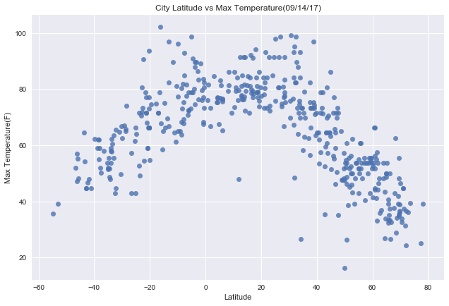
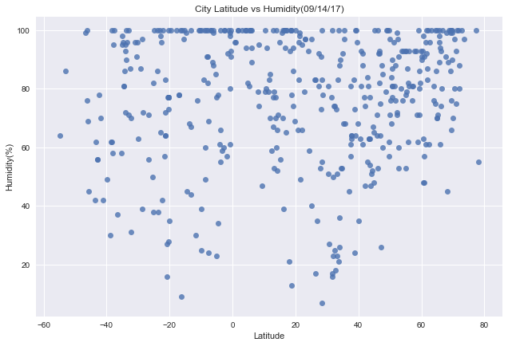
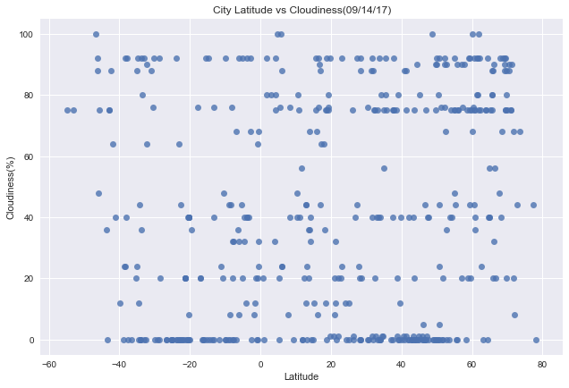
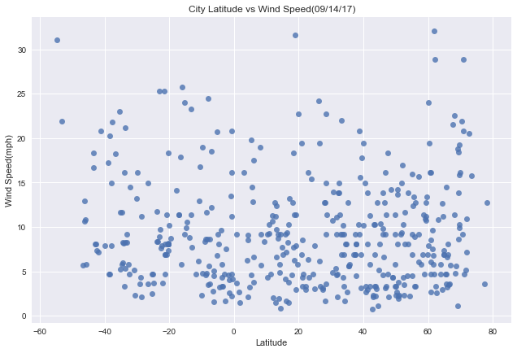

# WeatherPy

### Analysis

-  Observed trend 1: Temperature is higher for cities near Equator and tends to decrease as we move towards Poles.

-  Observed trend 2: Humidity of most cities is greater than 80%

-  Observed trend 3: Wind Speed of most cities is lower than 10mph


```python
from citipy import citipy as cp1
import random
import requests as req
import json
import pandas as pd
import matplotlib.pyplot as plt
import seaborn as sns
import time
import datetime
from pandas.io.json import json_normalize

dt = datetime.datetime.today().strftime('%m/%d/%y')
# Extract API key from external json file
keyPairs = open('../../../keys/appkey.json')
keyPairs_json = json.load(keyPairs)
owmkey = keyPairs_json['owmkey']
```

## Generate Cities List & Perform API calls


```python
# Using Citipy module, get 1000 random cities
# Using OpenWeatherMap API get weather data for the specific cities & Store the returned data into a dataframe to build the required plots.
cwData = pd.DataFrame([])
base_url = "http://api.openweathermap.org/data/2.5/weather?units=Imperial"
print('------------------------')
print('Beginning Data Retrieval')
print('------------------------')
for x in range(1,1001):
    rd_lat = random.randint(-90,90)
    rd_lng = random.randint(-180,180)
    city = cp1.nearest_city(rd_lat,rd_lng).city_name
    country = cp1.nearest_city(rd_lat,rd_lng).country_code
    cityCountry = city + "," + country
    upd_url = base_url + "&APPID=" + owmkey + "&q=" + cityCountry
    enc_url = upd_url.replace(upd_url[68:100],32*'*')
    print('Processing record ', x, ' | ', cityCountry)
    print(enc_url)
    try:
        res = req.get(upd_url)
        df_tmp = json_normalize(res.json())
        cwData = cwData.append(df_tmp)
    except Exception as e:
        print('Exception from Open Weather Map API: ', e)
    time.sleep(1)
print('------------------------')
print('Data Retrieval Complete')
print('------------------------')
```

    ------------------------
    Beginning Data Retrieval
    ------------------------
    Processing record  1  |  pangnirtung,ca
    http://api.openweathermap.org/data/2.5/weather?units=Imperial&APPID=********************************&q=pangnirtung,ca
    Processing record  2  |  coahuayana,mx
    http://api.openweathermap.org/data/2.5/weather?units=Imperial&APPID=********************************&q=coahuayana,mx
    Processing record  3  |  miranda,br
    http://api.openweathermap.org/data/2.5/weather?units=Imperial&APPID=********************************&q=miranda,br
    Processing record  4  |  mar del plata,ar
    http://api.openweathermap.org/data/2.5/weather?units=Imperial&APPID=********************************&q=mar del plata,ar
    Processing record  5  |  east london,za
    http://api.openweathermap.org/data/2.5/weather?units=Imperial&APPID=********************************&q=east london,za
    Processing record  6  |  hobart,au
    http://api.openweathermap.org/data/2.5/weather?units=Imperial&APPID=********************************&q=hobart,au
    Processing record  7  |  nyrad,dk
    http://api.openweathermap.org/data/2.5/weather?units=Imperial&APPID=********************************&q=nyrad,dk
    Processing record  8  |  zyryanka,ru
    http://api.openweathermap.org/data/2.5/weather?units=Imperial&APPID=********************************&q=zyryanka,ru
    Processing record  9  |  cape town,za
    http://api.openweathermap.org/data/2.5/weather?units=Imperial&APPID=********************************&q=cape town,za
    Processing record  10  |  barela,in
    http://api.openweathermap.org/data/2.5/weather?units=Imperial&APPID=********************************&q=barela,in
    Processing record  11  |  luderitz,na
    http://api.openweathermap.org/data/2.5/weather?units=Imperial&APPID=********************************&q=luderitz,na
    Processing record  12  |  neftcala,az
    http://api.openweathermap.org/data/2.5/weather?units=Imperial&APPID=********************************&q=neftcala,az
    Processing record  13  |  provideniya,ru
    http://api.openweathermap.org/data/2.5/weather?units=Imperial&APPID=********************************&q=provideniya,ru
    Processing record  14  |  tuktoyaktuk,ca
    http://api.openweathermap.org/data/2.5/weather?units=Imperial&APPID=********************************&q=tuktoyaktuk,ca
    Processing record  15  |  cape town,za
    http://api.openweathermap.org/data/2.5/weather?units=Imperial&APPID=********************************&q=cape town,za
    Processing record  16  |  nizhneyansk,ru
    http://api.openweathermap.org/data/2.5/weather?units=Imperial&APPID=********************************&q=nizhneyansk,ru
    Processing record  17  |  saint-philippe,re
    http://api.openweathermap.org/data/2.5/weather?units=Imperial&APPID=********************************&q=saint-philippe,re
    Processing record  18  |  baboua,cf
    http://api.openweathermap.org/data/2.5/weather?units=Imperial&APPID=********************************&q=baboua,cf
    Processing record  19  |  kinsale,ie
    http://api.openweathermap.org/data/2.5/weather?units=Imperial&APPID=********************************&q=kinsale,ie
    Processing record  20  |  punta arenas,cl
    http://api.openweathermap.org/data/2.5/weather?units=Imperial&APPID=********************************&q=punta arenas,cl
    Processing record  21  |  nizhneyansk,ru
    http://api.openweathermap.org/data/2.5/weather?units=Imperial&APPID=********************************&q=nizhneyansk,ru
    Processing record  22  |  mahebourg,mu
    http://api.openweathermap.org/data/2.5/weather?units=Imperial&APPID=********************************&q=mahebourg,mu
    Processing record  23  |  kursenai,lt
    http://api.openweathermap.org/data/2.5/weather?units=Imperial&APPID=********************************&q=kursenai,lt
    Processing record  24  |  albany,au
    http://api.openweathermap.org/data/2.5/weather?units=Imperial&APPID=********************************&q=albany,au
    Processing record  25  |  hithadhoo,mv
    http://api.openweathermap.org/data/2.5/weather?units=Imperial&APPID=********************************&q=hithadhoo,mv
    Processing record  26  |  tabuk,sa
    http://api.openweathermap.org/data/2.5/weather?units=Imperial&APPID=********************************&q=tabuk,sa
    Processing record  27  |  hobart,au
    http://api.openweathermap.org/data/2.5/weather?units=Imperial&APPID=********************************&q=hobart,au
    Processing record  28  |  busselton,au
    http://api.openweathermap.org/data/2.5/weather?units=Imperial&APPID=********************************&q=busselton,au
    Processing record  29  |  port alfred,za
    http://api.openweathermap.org/data/2.5/weather?units=Imperial&APPID=********************************&q=port alfred,za
    Processing record  30  |  ponta do sol,cv
    http://api.openweathermap.org/data/2.5/weather?units=Imperial&APPID=********************************&q=ponta do sol,cv
    Processing record  31  |  katsuura,jp
    http://api.openweathermap.org/data/2.5/weather?units=Imperial&APPID=********************************&q=katsuura,jp
    Processing record  32  |  gushikawa,jp
    http://api.openweathermap.org/data/2.5/weather?units=Imperial&APPID=********************************&q=gushikawa,jp
    Processing record  33  |  rio tercero,ar
    http://api.openweathermap.org/data/2.5/weather?units=Imperial&APPID=********************************&q=rio tercero,ar
    Processing record  34  |  ushuaia,ar
    http://api.openweathermap.org/data/2.5/weather?units=Imperial&APPID=********************************&q=ushuaia,ar
    Processing record  35  |  ust-karsk,ru
    http://api.openweathermap.org/data/2.5/weather?units=Imperial&APPID=********************************&q=ust-karsk,ru
    Processing record  36  |  matay,eg
    http://api.openweathermap.org/data/2.5/weather?units=Imperial&APPID=********************************&q=matay,eg
    Processing record  37  |  tecoanapa,mx
    http://api.openweathermap.org/data/2.5/weather?units=Imperial&APPID=********************************&q=tecoanapa,mx
    Processing record  38  |  tasiilaq,gl
    http://api.openweathermap.org/data/2.5/weather?units=Imperial&APPID=********************************&q=tasiilaq,gl
    Processing record  39  |  khatanga,ru
    http://api.openweathermap.org/data/2.5/weather?units=Imperial&APPID=********************************&q=khatanga,ru
    Processing record  40  |  coos bay,us
    http://api.openweathermap.org/data/2.5/weather?units=Imperial&APPID=********************************&q=coos bay,us
    Processing record  41  |  puerto ayora,ec
    http://api.openweathermap.org/data/2.5/weather?units=Imperial&APPID=********************************&q=puerto ayora,ec
    Processing record  42  |  severo-kurilsk,ru
    http://api.openweathermap.org/data/2.5/weather?units=Imperial&APPID=********************************&q=severo-kurilsk,ru
    Processing record  43  |  illoqqortoormiut,gl
    http://api.openweathermap.org/data/2.5/weather?units=Imperial&APPID=********************************&q=illoqqortoormiut,gl
    Processing record  44  |  ushuaia,ar
    http://api.openweathermap.org/data/2.5/weather?units=Imperial&APPID=********************************&q=ushuaia,ar
    Processing record  45  |  san cristobal,ec
    http://api.openweathermap.org/data/2.5/weather?units=Imperial&APPID=********************************&q=san cristobal,ec
    Processing record  46  |  butaritari,ki
    http://api.openweathermap.org/data/2.5/weather?units=Imperial&APPID=********************************&q=butaritari,ki
    Processing record  47  |  taolanaro,mg
    http://api.openweathermap.org/data/2.5/weather?units=Imperial&APPID=********************************&q=taolanaro,mg
    Processing record  48  |  kruisfontein,za
    http://api.openweathermap.org/data/2.5/weather?units=Imperial&APPID=********************************&q=kruisfontein,za
    Processing record  49  |  lagoa,pt
    http://api.openweathermap.org/data/2.5/weather?units=Imperial&APPID=********************************&q=lagoa,pt
    Processing record  50  |  zyryanka,ru
    http://api.openweathermap.org/data/2.5/weather?units=Imperial&APPID=********************************&q=zyryanka,ru
    Processing record  51  |  kaitangata,nz
    http://api.openweathermap.org/data/2.5/weather?units=Imperial&APPID=********************************&q=kaitangata,nz
    Processing record  52  |  soure,br
    http://api.openweathermap.org/data/2.5/weather?units=Imperial&APPID=********************************&q=soure,br
    Processing record  53  |  kapaa,us
    http://api.openweathermap.org/data/2.5/weather?units=Imperial&APPID=********************************&q=kapaa,us
    Processing record  54  |  taseyevo,ru
    http://api.openweathermap.org/data/2.5/weather?units=Imperial&APPID=********************************&q=taseyevo,ru
    Processing record  55  |  cape town,za
    http://api.openweathermap.org/data/2.5/weather?units=Imperial&APPID=********************************&q=cape town,za
    Processing record  56  |  solnechnyy,ru
    http://api.openweathermap.org/data/2.5/weather?units=Imperial&APPID=********************************&q=solnechnyy,ru
    Processing record  57  |  yellowknife,ca
    http://api.openweathermap.org/data/2.5/weather?units=Imperial&APPID=********************************&q=yellowknife,ca
    Processing record  58  |  tuktoyaktuk,ca
    http://api.openweathermap.org/data/2.5/weather?units=Imperial&APPID=********************************&q=tuktoyaktuk,ca
    Processing record  59  |  hithadhoo,mv
    http://api.openweathermap.org/data/2.5/weather?units=Imperial&APPID=********************************&q=hithadhoo,mv
    Processing record  60  |  lebu,cl
    http://api.openweathermap.org/data/2.5/weather?units=Imperial&APPID=********************************&q=lebu,cl
    Processing record  61  |  belushya guba,ru
    http://api.openweathermap.org/data/2.5/weather?units=Imperial&APPID=********************************&q=belushya guba,ru
    Processing record  62  |  pangnirtung,ca
    http://api.openweathermap.org/data/2.5/weather?units=Imperial&APPID=********************************&q=pangnirtung,ca
    Processing record  63  |  grand centre,ca
    http://api.openweathermap.org/data/2.5/weather?units=Imperial&APPID=********************************&q=grand centre,ca
    Processing record  64  |  vaini,to
    http://api.openweathermap.org/data/2.5/weather?units=Imperial&APPID=********************************&q=vaini,to
    Processing record  65  |  malwan,in
    http://api.openweathermap.org/data/2.5/weather?units=Imperial&APPID=********************************&q=malwan,in
    Processing record  66  |  east london,za
    http://api.openweathermap.org/data/2.5/weather?units=Imperial&APPID=********************************&q=east london,za
    Processing record  67  |  jamestown,sh
    http://api.openweathermap.org/data/2.5/weather?units=Imperial&APPID=********************************&q=jamestown,sh
    Processing record  68  |  victoria,sc
    http://api.openweathermap.org/data/2.5/weather?units=Imperial&APPID=********************************&q=victoria,sc
    Processing record  69  |  rikitea,pf
    http://api.openweathermap.org/data/2.5/weather?units=Imperial&APPID=********************************&q=rikitea,pf
    Processing record  70  |  bredasdorp,za
    http://api.openweathermap.org/data/2.5/weather?units=Imperial&APPID=********************************&q=bredasdorp,za
    Processing record  71  |  ushuaia,ar
    http://api.openweathermap.org/data/2.5/weather?units=Imperial&APPID=********************************&q=ushuaia,ar
    Processing record  72  |  saleaula,ws
    http://api.openweathermap.org/data/2.5/weather?units=Imperial&APPID=********************************&q=saleaula,ws
    Processing record  73  |  nantucket,us
    http://api.openweathermap.org/data/2.5/weather?units=Imperial&APPID=********************************&q=nantucket,us
    Processing record  74  |  acajutla,sv
    http://api.openweathermap.org/data/2.5/weather?units=Imperial&APPID=********************************&q=acajutla,sv
    Processing record  75  |  barrow,us
    http://api.openweathermap.org/data/2.5/weather?units=Imperial&APPID=********************************&q=barrow,us
    Processing record  76  |  naze,jp
    http://api.openweathermap.org/data/2.5/weather?units=Imperial&APPID=********************************&q=naze,jp
    Processing record  77  |  port alfred,za
    http://api.openweathermap.org/data/2.5/weather?units=Imperial&APPID=********************************&q=port alfred,za
    Processing record  78  |  tasiilaq,gl
    http://api.openweathermap.org/data/2.5/weather?units=Imperial&APPID=********************************&q=tasiilaq,gl
    Processing record  79  |  bluff,nz
    http://api.openweathermap.org/data/2.5/weather?units=Imperial&APPID=********************************&q=bluff,nz
    Processing record  80  |  ushuaia,ar
    http://api.openweathermap.org/data/2.5/weather?units=Imperial&APPID=********************************&q=ushuaia,ar
    Processing record  81  |  roebourne,au
    http://api.openweathermap.org/data/2.5/weather?units=Imperial&APPID=********************************&q=roebourne,au
    Processing record  82  |  port elizabeth,za
    http://api.openweathermap.org/data/2.5/weather?units=Imperial&APPID=********************************&q=port elizabeth,za
    Processing record  83  |  hermanus,za
    http://api.openweathermap.org/data/2.5/weather?units=Imperial&APPID=********************************&q=hermanus,za
    Processing record  84  |  bluff,nz
    http://api.openweathermap.org/data/2.5/weather?units=Imperial&APPID=********************************&q=bluff,nz
    Processing record  85  |  hay river,ca
    http://api.openweathermap.org/data/2.5/weather?units=Imperial&APPID=********************************&q=hay river,ca
    Processing record  86  |  iskateley,ru
    http://api.openweathermap.org/data/2.5/weather?units=Imperial&APPID=********************************&q=iskateley,ru
    Processing record  87  |  tumannyy,ru
    http://api.openweathermap.org/data/2.5/weather?units=Imperial&APPID=********************************&q=tumannyy,ru
    Processing record  88  |  port augusta,au
    http://api.openweathermap.org/data/2.5/weather?units=Imperial&APPID=********************************&q=port augusta,au
    Processing record  89  |  atuona,pf
    http://api.openweathermap.org/data/2.5/weather?units=Imperial&APPID=********************************&q=atuona,pf
    Processing record  90  |  castro,cl
    http://api.openweathermap.org/data/2.5/weather?units=Imperial&APPID=********************************&q=castro,cl
    Processing record  91  |  oranjestad,aw
    http://api.openweathermap.org/data/2.5/weather?units=Imperial&APPID=********************************&q=oranjestad,aw
    Processing record  92  |  busselton,au
    http://api.openweathermap.org/data/2.5/weather?units=Imperial&APPID=********************************&q=busselton,au
    Processing record  93  |  margate,za
    http://api.openweathermap.org/data/2.5/weather?units=Imperial&APPID=********************************&q=margate,za
    Processing record  94  |  port lincoln,au
    http://api.openweathermap.org/data/2.5/weather?units=Imperial&APPID=********************************&q=port lincoln,au
    Processing record  95  |  tasiilaq,gl
    http://api.openweathermap.org/data/2.5/weather?units=Imperial&APPID=********************************&q=tasiilaq,gl
    Processing record  96  |  lososina,ru
    http://api.openweathermap.org/data/2.5/weather?units=Imperial&APPID=********************************&q=lososina,ru
    Processing record  97  |  vaini,to
    http://api.openweathermap.org/data/2.5/weather?units=Imperial&APPID=********************************&q=vaini,to
    Processing record  98  |  poso,id
    http://api.openweathermap.org/data/2.5/weather?units=Imperial&APPID=********************************&q=poso,id
    Processing record  99  |  klaksvik,fo
    http://api.openweathermap.org/data/2.5/weather?units=Imperial&APPID=********************************&q=klaksvik,fo
    Processing record  100  |  coihaique,cl
    http://api.openweathermap.org/data/2.5/weather?units=Imperial&APPID=********************************&q=coihaique,cl
    Processing record  101  |  khatanga,ru
    http://api.openweathermap.org/data/2.5/weather?units=Imperial&APPID=********************************&q=khatanga,ru
    Processing record  102  |  ribeira grande,pt
    http://api.openweathermap.org/data/2.5/weather?units=Imperial&APPID=********************************&q=ribeira grande,pt
    Processing record  103  |  mataura,pf
    http://api.openweathermap.org/data/2.5/weather?units=Imperial&APPID=********************************&q=mataura,pf
    Processing record  104  |  sitka,us
    http://api.openweathermap.org/data/2.5/weather?units=Imperial&APPID=********************************&q=sitka,us
    Processing record  105  |  zhangjiakou,cn
    http://api.openweathermap.org/data/2.5/weather?units=Imperial&APPID=********************************&q=zhangjiakou,cn
    Processing record  106  |  hermanus,za
    http://api.openweathermap.org/data/2.5/weather?units=Imperial&APPID=********************************&q=hermanus,za
    Processing record  107  |  albany,au
    http://api.openweathermap.org/data/2.5/weather?units=Imperial&APPID=********************************&q=albany,au
    Processing record  108  |  yellowknife,ca
    http://api.openweathermap.org/data/2.5/weather?units=Imperial&APPID=********************************&q=yellowknife,ca
    Processing record  109  |  dikson,ru
    http://api.openweathermap.org/data/2.5/weather?units=Imperial&APPID=********************************&q=dikson,ru
    Processing record  110  |  qaanaaq,gl
    http://api.openweathermap.org/data/2.5/weather?units=Imperial&APPID=********************************&q=qaanaaq,gl
    Processing record  111  |  bien hoa,vn
    http://api.openweathermap.org/data/2.5/weather?units=Imperial&APPID=********************************&q=bien hoa,vn
    Processing record  112  |  isangel,vu
    http://api.openweathermap.org/data/2.5/weather?units=Imperial&APPID=********************************&q=isangel,vu
    Processing record  113  |  kuche,cn
    http://api.openweathermap.org/data/2.5/weather?units=Imperial&APPID=********************************&q=kuche,cn
    Processing record  114  |  sitka,us
    http://api.openweathermap.org/data/2.5/weather?units=Imperial&APPID=********************************&q=sitka,us
    Processing record  115  |  charters towers,au
    http://api.openweathermap.org/data/2.5/weather?units=Imperial&APPID=********************************&q=charters towers,au
    Processing record  116  |  solnechnyy,ru
    http://api.openweathermap.org/data/2.5/weather?units=Imperial&APPID=********************************&q=solnechnyy,ru
    Processing record  117  |  tottori,jp
    http://api.openweathermap.org/data/2.5/weather?units=Imperial&APPID=********************************&q=tottori,jp
    Processing record  118  |  la palma,pa
    http://api.openweathermap.org/data/2.5/weather?units=Imperial&APPID=********************************&q=la palma,pa
    Processing record  119  |  faanui,pf
    http://api.openweathermap.org/data/2.5/weather?units=Imperial&APPID=********************************&q=faanui,pf
    Processing record  120  |  busselton,au
    http://api.openweathermap.org/data/2.5/weather?units=Imperial&APPID=********************************&q=busselton,au
    Processing record  121  |  vao,nc
    http://api.openweathermap.org/data/2.5/weather?units=Imperial&APPID=********************************&q=vao,nc
    Processing record  122  |  busselton,au
    http://api.openweathermap.org/data/2.5/weather?units=Imperial&APPID=********************************&q=busselton,au
    Processing record  123  |  port alfred,za
    http://api.openweathermap.org/data/2.5/weather?units=Imperial&APPID=********************************&q=port alfred,za
    Processing record  124  |  kapaa,us
    http://api.openweathermap.org/data/2.5/weather?units=Imperial&APPID=********************************&q=kapaa,us
    Processing record  125  |  rikitea,pf
    http://api.openweathermap.org/data/2.5/weather?units=Imperial&APPID=********************************&q=rikitea,pf
    Processing record  126  |  punta arenas,cl
    http://api.openweathermap.org/data/2.5/weather?units=Imperial&APPID=********************************&q=punta arenas,cl
    Processing record  127  |  castro,cl
    http://api.openweathermap.org/data/2.5/weather?units=Imperial&APPID=********************************&q=castro,cl
    Processing record  128  |  jamestown,sh
    http://api.openweathermap.org/data/2.5/weather?units=Imperial&APPID=********************************&q=jamestown,sh
    Processing record  129  |  vaini,to
    http://api.openweathermap.org/data/2.5/weather?units=Imperial&APPID=********************************&q=vaini,to
    Processing record  130  |  santa rosa,ar
    http://api.openweathermap.org/data/2.5/weather?units=Imperial&APPID=********************************&q=santa rosa,ar
    Processing record  131  |  taolanaro,mg
    http://api.openweathermap.org/data/2.5/weather?units=Imperial&APPID=********************************&q=taolanaro,mg
    Processing record  132  |  cape town,za
    http://api.openweathermap.org/data/2.5/weather?units=Imperial&APPID=********************************&q=cape town,za
    Processing record  133  |  rikitea,pf
    http://api.openweathermap.org/data/2.5/weather?units=Imperial&APPID=********************************&q=rikitea,pf
    Processing record  134  |  lebu,cl
    http://api.openweathermap.org/data/2.5/weather?units=Imperial&APPID=********************************&q=lebu,cl
    Processing record  135  |  nikolskoye,ru
    http://api.openweathermap.org/data/2.5/weather?units=Imperial&APPID=********************************&q=nikolskoye,ru
    Processing record  136  |  chagda,ru
    http://api.openweathermap.org/data/2.5/weather?units=Imperial&APPID=********************************&q=chagda,ru
    Processing record  137  |  meulaboh,id
    http://api.openweathermap.org/data/2.5/weather?units=Imperial&APPID=********************************&q=meulaboh,id
    Processing record  138  |  yellowknife,ca
    http://api.openweathermap.org/data/2.5/weather?units=Imperial&APPID=********************************&q=yellowknife,ca
    Processing record  139  |  ilulissat,gl
    http://api.openweathermap.org/data/2.5/weather?units=Imperial&APPID=********************************&q=ilulissat,gl
    Processing record  140  |  khatanga,ru
    http://api.openweathermap.org/data/2.5/weather?units=Imperial&APPID=********************************&q=khatanga,ru
    Processing record  141  |  thompson,ca
    http://api.openweathermap.org/data/2.5/weather?units=Imperial&APPID=********************************&q=thompson,ca
    Processing record  142  |  westport,ie
    http://api.openweathermap.org/data/2.5/weather?units=Imperial&APPID=********************************&q=westport,ie
    Processing record  143  |  bluff,nz
    http://api.openweathermap.org/data/2.5/weather?units=Imperial&APPID=********************************&q=bluff,nz
    Processing record  144  |  belushya guba,ru
    http://api.openweathermap.org/data/2.5/weather?units=Imperial&APPID=********************************&q=belushya guba,ru
    Processing record  145  |  busselton,au
    http://api.openweathermap.org/data/2.5/weather?units=Imperial&APPID=********************************&q=busselton,au
    Processing record  146  |  puerto del rosario,es
    http://api.openweathermap.org/data/2.5/weather?units=Imperial&APPID=********************************&q=puerto del rosario,es
    Processing record  147  |  jiddah,sa
    http://api.openweathermap.org/data/2.5/weather?units=Imperial&APPID=********************************&q=jiddah,sa
    Processing record  148  |  avarua,ck
    http://api.openweathermap.org/data/2.5/weather?units=Imperial&APPID=********************************&q=avarua,ck
    Processing record  149  |  aksarka,ru
    http://api.openweathermap.org/data/2.5/weather?units=Imperial&APPID=********************************&q=aksarka,ru
    Processing record  150  |  gilazi,az
    http://api.openweathermap.org/data/2.5/weather?units=Imperial&APPID=********************************&q=gilazi,az
    Processing record  151  |  airai,pw
    http://api.openweathermap.org/data/2.5/weather?units=Imperial&APPID=********************************&q=airai,pw
    Processing record  152  |  busselton,au
    http://api.openweathermap.org/data/2.5/weather?units=Imperial&APPID=********************************&q=busselton,au
    Processing record  153  |  poum,nc
    http://api.openweathermap.org/data/2.5/weather?units=Imperial&APPID=********************************&q=poum,nc
    Processing record  154  |  masjed-e soleyman,ir
    http://api.openweathermap.org/data/2.5/weather?units=Imperial&APPID=********************************&q=masjed-e soleyman,ir
    Processing record  155  |  busselton,au
    http://api.openweathermap.org/data/2.5/weather?units=Imperial&APPID=********************************&q=busselton,au
    Processing record  156  |  saint-philippe,re
    http://api.openweathermap.org/data/2.5/weather?units=Imperial&APPID=********************************&q=saint-philippe,re
    Processing record  157  |  mataura,pf
    http://api.openweathermap.org/data/2.5/weather?units=Imperial&APPID=********************************&q=mataura,pf
    Processing record  158  |  attawapiskat,ca
    http://api.openweathermap.org/data/2.5/weather?units=Imperial&APPID=********************************&q=attawapiskat,ca
    Processing record  159  |  kaitangata,nz
    http://api.openweathermap.org/data/2.5/weather?units=Imperial&APPID=********************************&q=kaitangata,nz
    Processing record  160  |  egvekinot,ru
    http://api.openweathermap.org/data/2.5/weather?units=Imperial&APPID=********************************&q=egvekinot,ru
    Processing record  161  |  mount gambier,au
    http://api.openweathermap.org/data/2.5/weather?units=Imperial&APPID=********************************&q=mount gambier,au
    Processing record  162  |  sarangani,ph
    http://api.openweathermap.org/data/2.5/weather?units=Imperial&APPID=********************************&q=sarangani,ph
    Processing record  163  |  nikolskoye,ru
    http://api.openweathermap.org/data/2.5/weather?units=Imperial&APPID=********************************&q=nikolskoye,ru
    Processing record  164  |  hobart,au
    http://api.openweathermap.org/data/2.5/weather?units=Imperial&APPID=********************************&q=hobart,au
    Processing record  165  |  faya,td
    http://api.openweathermap.org/data/2.5/weather?units=Imperial&APPID=********************************&q=faya,td
    Processing record  166  |  punta arenas,cl
    http://api.openweathermap.org/data/2.5/weather?units=Imperial&APPID=********************************&q=punta arenas,cl
    Processing record  167  |  leningradskiy,ru
    http://api.openweathermap.org/data/2.5/weather?units=Imperial&APPID=********************************&q=leningradskiy,ru
    Processing record  168  |  avarua,ck
    http://api.openweathermap.org/data/2.5/weather?units=Imperial&APPID=********************************&q=avarua,ck
    Processing record  169  |  cidreira,br
    http://api.openweathermap.org/data/2.5/weather?units=Imperial&APPID=********************************&q=cidreira,br
    Processing record  170  |  turukhansk,ru
    http://api.openweathermap.org/data/2.5/weather?units=Imperial&APPID=********************************&q=turukhansk,ru
    Processing record  171  |  sosnovo-ozerskoye,ru
    http://api.openweathermap.org/data/2.5/weather?units=Imperial&APPID=********************************&q=sosnovo-ozerskoye,ru
    Processing record  172  |  barabinsk,ru
    http://api.openweathermap.org/data/2.5/weather?units=Imperial&APPID=********************************&q=barabinsk,ru
    Processing record  173  |  jamestown,sh
    http://api.openweathermap.org/data/2.5/weather?units=Imperial&APPID=********************************&q=jamestown,sh
    Processing record  174  |  clyde river,ca
    http://api.openweathermap.org/data/2.5/weather?units=Imperial&APPID=********************************&q=clyde river,ca
    Processing record  175  |  qaqortoq,gl
    http://api.openweathermap.org/data/2.5/weather?units=Imperial&APPID=********************************&q=qaqortoq,gl
    Processing record  176  |  vallenar,cl
    http://api.openweathermap.org/data/2.5/weather?units=Imperial&APPID=********************************&q=vallenar,cl
    Processing record  177  |  turayf,sa
    http://api.openweathermap.org/data/2.5/weather?units=Imperial&APPID=********************************&q=turayf,sa
    Processing record  178  |  cape town,za
    http://api.openweathermap.org/data/2.5/weather?units=Imperial&APPID=********************************&q=cape town,za
    Processing record  179  |  gushikawa,jp
    http://api.openweathermap.org/data/2.5/weather?units=Imperial&APPID=********************************&q=gushikawa,jp
    Processing record  180  |  vaini,to
    http://api.openweathermap.org/data/2.5/weather?units=Imperial&APPID=********************************&q=vaini,to
    Processing record  181  |  ushuaia,ar
    http://api.openweathermap.org/data/2.5/weather?units=Imperial&APPID=********************************&q=ushuaia,ar
    Processing record  182  |  bababe,mr
    http://api.openweathermap.org/data/2.5/weather?units=Imperial&APPID=********************************&q=bababe,mr
    Processing record  183  |  polunochnoye,ru
    http://api.openweathermap.org/data/2.5/weather?units=Imperial&APPID=********************************&q=polunochnoye,ru
    Processing record  184  |  san jose,gt
    http://api.openweathermap.org/data/2.5/weather?units=Imperial&APPID=********************************&q=san jose,gt
    Processing record  185  |  kapaa,us
    http://api.openweathermap.org/data/2.5/weather?units=Imperial&APPID=********************************&q=kapaa,us
    Processing record  186  |  busselton,au
    http://api.openweathermap.org/data/2.5/weather?units=Imperial&APPID=********************************&q=busselton,au
    Processing record  187  |  caravelas,br
    http://api.openweathermap.org/data/2.5/weather?units=Imperial&APPID=********************************&q=caravelas,br
    Processing record  188  |  cabo san lucas,mx
    http://api.openweathermap.org/data/2.5/weather?units=Imperial&APPID=********************************&q=cabo san lucas,mx
    Processing record  189  |  dingle,ie
    http://api.openweathermap.org/data/2.5/weather?units=Imperial&APPID=********************************&q=dingle,ie
    Processing record  190  |  cartagena,co
    http://api.openweathermap.org/data/2.5/weather?units=Imperial&APPID=********************************&q=cartagena,co
    Processing record  191  |  katherine,au
    http://api.openweathermap.org/data/2.5/weather?units=Imperial&APPID=********************************&q=katherine,au
    Processing record  192  |  rikitea,pf
    http://api.openweathermap.org/data/2.5/weather?units=Imperial&APPID=********************************&q=rikitea,pf
    Processing record  193  |  labutta,mm
    http://api.openweathermap.org/data/2.5/weather?units=Imperial&APPID=********************************&q=labutta,mm
    Processing record  194  |  hermanus,za
    http://api.openweathermap.org/data/2.5/weather?units=Imperial&APPID=********************************&q=hermanus,za
    Processing record  195  |  chokurdakh,ru
    http://api.openweathermap.org/data/2.5/weather?units=Imperial&APPID=********************************&q=chokurdakh,ru
    Processing record  196  |  port alfred,za
    http://api.openweathermap.org/data/2.5/weather?units=Imperial&APPID=********************************&q=port alfred,za
    Processing record  197  |  albany,au
    http://api.openweathermap.org/data/2.5/weather?units=Imperial&APPID=********************************&q=albany,au
    Processing record  198  |  kodiak,us
    http://api.openweathermap.org/data/2.5/weather?units=Imperial&APPID=********************************&q=kodiak,us
    Processing record  199  |  carnarvon,au
    http://api.openweathermap.org/data/2.5/weather?units=Imperial&APPID=********************************&q=carnarvon,au
    Processing record  200  |  punta arenas,cl
    http://api.openweathermap.org/data/2.5/weather?units=Imperial&APPID=********************************&q=punta arenas,cl
    Processing record  201  |  dzhusaly,kz
    http://api.openweathermap.org/data/2.5/weather?units=Imperial&APPID=********************************&q=dzhusaly,kz
    Processing record  202  |  albany,au
    http://api.openweathermap.org/data/2.5/weather?units=Imperial&APPID=********************************&q=albany,au
    Processing record  203  |  airai,pw
    http://api.openweathermap.org/data/2.5/weather?units=Imperial&APPID=********************************&q=airai,pw
    Processing record  204  |  fortuna,us
    http://api.openweathermap.org/data/2.5/weather?units=Imperial&APPID=********************************&q=fortuna,us
    Processing record  205  |  sao filipe,cv
    http://api.openweathermap.org/data/2.5/weather?units=Imperial&APPID=********************************&q=sao filipe,cv
    Processing record  206  |  upernavik,gl
    http://api.openweathermap.org/data/2.5/weather?units=Imperial&APPID=********************************&q=upernavik,gl
    Processing record  207  |  codrington,ag
    http://api.openweathermap.org/data/2.5/weather?units=Imperial&APPID=********************************&q=codrington,ag
    Processing record  208  |  mataura,pf
    http://api.openweathermap.org/data/2.5/weather?units=Imperial&APPID=********************************&q=mataura,pf
    Processing record  209  |  busselton,au
    http://api.openweathermap.org/data/2.5/weather?units=Imperial&APPID=********************************&q=busselton,au
    Processing record  210  |  cape town,za
    http://api.openweathermap.org/data/2.5/weather?units=Imperial&APPID=********************************&q=cape town,za
    Processing record  211  |  talnakh,ru
    http://api.openweathermap.org/data/2.5/weather?units=Imperial&APPID=********************************&q=talnakh,ru
    Processing record  212  |  soyo,ao
    http://api.openweathermap.org/data/2.5/weather?units=Imperial&APPID=********************************&q=soyo,ao
    Processing record  213  |  punta arenas,cl
    http://api.openweathermap.org/data/2.5/weather?units=Imperial&APPID=********************************&q=punta arenas,cl
    Processing record  214  |  vaini,to
    http://api.openweathermap.org/data/2.5/weather?units=Imperial&APPID=********************************&q=vaini,to
    Processing record  215  |  sao filipe,cv
    http://api.openweathermap.org/data/2.5/weather?units=Imperial&APPID=********************************&q=sao filipe,cv
    Processing record  216  |  barrow,us
    http://api.openweathermap.org/data/2.5/weather?units=Imperial&APPID=********************************&q=barrow,us
    Processing record  217  |  rikitea,pf
    http://api.openweathermap.org/data/2.5/weather?units=Imperial&APPID=********************************&q=rikitea,pf
    Processing record  218  |  nikolskoye,ru
    http://api.openweathermap.org/data/2.5/weather?units=Imperial&APPID=********************************&q=nikolskoye,ru
    Processing record  219  |  punta arenas,cl
    http://api.openweathermap.org/data/2.5/weather?units=Imperial&APPID=********************************&q=punta arenas,cl
    Processing record  220  |  puerto ayora,ec
    http://api.openweathermap.org/data/2.5/weather?units=Imperial&APPID=********************************&q=puerto ayora,ec
    Processing record  221  |  saryshagan,kz
    http://api.openweathermap.org/data/2.5/weather?units=Imperial&APPID=********************************&q=saryshagan,kz
    Processing record  222  |  bubaque,gw
    http://api.openweathermap.org/data/2.5/weather?units=Imperial&APPID=********************************&q=bubaque,gw
    Processing record  223  |  airai,pw
    http://api.openweathermap.org/data/2.5/weather?units=Imperial&APPID=********************************&q=airai,pw
    Processing record  224  |  beringovskiy,ru
    http://api.openweathermap.org/data/2.5/weather?units=Imperial&APPID=********************************&q=beringovskiy,ru
    Processing record  225  |  durant,us
    http://api.openweathermap.org/data/2.5/weather?units=Imperial&APPID=********************************&q=durant,us
    Processing record  226  |  onguday,ru
    http://api.openweathermap.org/data/2.5/weather?units=Imperial&APPID=********************************&q=onguday,ru
    Processing record  227  |  quatre cocos,mu
    http://api.openweathermap.org/data/2.5/weather?units=Imperial&APPID=********************************&q=quatre cocos,mu
    Processing record  228  |  roma,au
    http://api.openweathermap.org/data/2.5/weather?units=Imperial&APPID=********************************&q=roma,au
    Processing record  229  |  mount isa,au
    http://api.openweathermap.org/data/2.5/weather?units=Imperial&APPID=********************************&q=mount isa,au
    Processing record  230  |  fevik,no
    http://api.openweathermap.org/data/2.5/weather?units=Imperial&APPID=********************************&q=fevik,no
    Processing record  231  |  nikolskoye,ru
    http://api.openweathermap.org/data/2.5/weather?units=Imperial&APPID=********************************&q=nikolskoye,ru
    Processing record  232  |  ushuaia,ar
    http://api.openweathermap.org/data/2.5/weather?units=Imperial&APPID=********************************&q=ushuaia,ar
    Processing record  233  |  la ronge,ca
    http://api.openweathermap.org/data/2.5/weather?units=Imperial&APPID=********************************&q=la ronge,ca
    Processing record  234  |  evanston,us
    http://api.openweathermap.org/data/2.5/weather?units=Imperial&APPID=********************************&q=evanston,us
    Processing record  235  |  belaya gora,ru
    http://api.openweathermap.org/data/2.5/weather?units=Imperial&APPID=********************************&q=belaya gora,ru
    Processing record  236  |  oshnaviyeh,ir
    http://api.openweathermap.org/data/2.5/weather?units=Imperial&APPID=********************************&q=oshnaviyeh,ir
    Processing record  237  |  camacha,pt
    http://api.openweathermap.org/data/2.5/weather?units=Imperial&APPID=********************************&q=camacha,pt
    Processing record  238  |  palana,ru
    http://api.openweathermap.org/data/2.5/weather?units=Imperial&APPID=********************************&q=palana,ru
    Processing record  239  |  yellowknife,ca
    http://api.openweathermap.org/data/2.5/weather?units=Imperial&APPID=********************************&q=yellowknife,ca
    Processing record  240  |  ginda,er
    http://api.openweathermap.org/data/2.5/weather?units=Imperial&APPID=********************************&q=ginda,er
    Processing record  241  |  klaksvik,fo
    http://api.openweathermap.org/data/2.5/weather?units=Imperial&APPID=********************************&q=klaksvik,fo
    Processing record  242  |  albany,au
    http://api.openweathermap.org/data/2.5/weather?units=Imperial&APPID=********************************&q=albany,au
    Processing record  243  |  balyaga,ru
    http://api.openweathermap.org/data/2.5/weather?units=Imperial&APPID=********************************&q=balyaga,ru
    Processing record  244  |  arraial do cabo,br
    http://api.openweathermap.org/data/2.5/weather?units=Imperial&APPID=********************************&q=arraial do cabo,br
    Processing record  245  |  bara,sd
    http://api.openweathermap.org/data/2.5/weather?units=Imperial&APPID=********************************&q=bara,sd
    Processing record  246  |  birao,cf
    http://api.openweathermap.org/data/2.5/weather?units=Imperial&APPID=********************************&q=birao,cf
    Processing record  247  |  ushuaia,ar
    http://api.openweathermap.org/data/2.5/weather?units=Imperial&APPID=********************************&q=ushuaia,ar
    Processing record  248  |  mataura,pf
    http://api.openweathermap.org/data/2.5/weather?units=Imperial&APPID=********************************&q=mataura,pf
    Processing record  249  |  busselton,au
    http://api.openweathermap.org/data/2.5/weather?units=Imperial&APPID=********************************&q=busselton,au
    Processing record  250  |  chuy,uy
    http://api.openweathermap.org/data/2.5/weather?units=Imperial&APPID=********************************&q=chuy,uy
    Processing record  251  |  pevek,ru
    http://api.openweathermap.org/data/2.5/weather?units=Imperial&APPID=********************************&q=pevek,ru
    Processing record  252  |  mataura,pf
    http://api.openweathermap.org/data/2.5/weather?units=Imperial&APPID=********************************&q=mataura,pf
    Processing record  253  |  arraial do cabo,br
    http://api.openweathermap.org/data/2.5/weather?units=Imperial&APPID=********************************&q=arraial do cabo,br
    Processing record  254  |  teresina,br
    http://api.openweathermap.org/data/2.5/weather?units=Imperial&APPID=********************************&q=teresina,br
    Processing record  255  |  kieta,pg
    http://api.openweathermap.org/data/2.5/weather?units=Imperial&APPID=********************************&q=kieta,pg
    Processing record  256  |  cherskiy,ru
    http://api.openweathermap.org/data/2.5/weather?units=Imperial&APPID=********************************&q=cherskiy,ru
    Processing record  257  |  nikolskoye,ru
    http://api.openweathermap.org/data/2.5/weather?units=Imperial&APPID=********************************&q=nikolskoye,ru
    Processing record  258  |  clyde river,ca
    http://api.openweathermap.org/data/2.5/weather?units=Imperial&APPID=********************************&q=clyde river,ca
    Processing record  259  |  belushya guba,ru
    http://api.openweathermap.org/data/2.5/weather?units=Imperial&APPID=********************************&q=belushya guba,ru
    Processing record  260  |  naron,es
    http://api.openweathermap.org/data/2.5/weather?units=Imperial&APPID=********************************&q=naron,es
    Processing record  261  |  danilovka,ru
    http://api.openweathermap.org/data/2.5/weather?units=Imperial&APPID=********************************&q=danilovka,ru
    Processing record  262  |  gorom-gorom,bf
    http://api.openweathermap.org/data/2.5/weather?units=Imperial&APPID=********************************&q=gorom-gorom,bf
    Processing record  263  |  east london,za
    http://api.openweathermap.org/data/2.5/weather?units=Imperial&APPID=********************************&q=east london,za
    Processing record  264  |  puerto ayora,ec
    http://api.openweathermap.org/data/2.5/weather?units=Imperial&APPID=********************************&q=puerto ayora,ec
    Processing record  265  |  maiduguri,ng
    http://api.openweathermap.org/data/2.5/weather?units=Imperial&APPID=********************************&q=maiduguri,ng
    Processing record  266  |  ulaangom,mn
    http://api.openweathermap.org/data/2.5/weather?units=Imperial&APPID=********************************&q=ulaangom,mn
    Processing record  267  |  kimparana,ml
    http://api.openweathermap.org/data/2.5/weather?units=Imperial&APPID=********************************&q=kimparana,ml
    Processing record  268  |  bethel,us
    http://api.openweathermap.org/data/2.5/weather?units=Imperial&APPID=********************************&q=bethel,us
    Processing record  269  |  codo,br
    http://api.openweathermap.org/data/2.5/weather?units=Imperial&APPID=********************************&q=codo,br
    Processing record  270  |  bemidji,us
    http://api.openweathermap.org/data/2.5/weather?units=Imperial&APPID=********************************&q=bemidji,us
    Processing record  271  |  vaitupu,wf
    http://api.openweathermap.org/data/2.5/weather?units=Imperial&APPID=********************************&q=vaitupu,wf
    Processing record  272  |  labuhan,id
    http://api.openweathermap.org/data/2.5/weather?units=Imperial&APPID=********************************&q=labuhan,id
    Processing record  273  |  barrow,us
    http://api.openweathermap.org/data/2.5/weather?units=Imperial&APPID=********************************&q=barrow,us
    Processing record  274  |  hilo,us
    http://api.openweathermap.org/data/2.5/weather?units=Imperial&APPID=********************************&q=hilo,us
    Processing record  275  |  maine-soroa,ne
    http://api.openweathermap.org/data/2.5/weather?units=Imperial&APPID=********************************&q=maine-soroa,ne
    Processing record  276  |  saint-philippe,re
    http://api.openweathermap.org/data/2.5/weather?units=Imperial&APPID=********************************&q=saint-philippe,re
    Processing record  277  |  provideniya,ru
    http://api.openweathermap.org/data/2.5/weather?units=Imperial&APPID=********************************&q=provideniya,ru
    Processing record  278  |  nikolskoye,ru
    http://api.openweathermap.org/data/2.5/weather?units=Imperial&APPID=********************************&q=nikolskoye,ru
    Processing record  279  |  ushuaia,ar
    http://api.openweathermap.org/data/2.5/weather?units=Imperial&APPID=********************************&q=ushuaia,ar
    Processing record  280  |  kasongo-lunda,cd
    http://api.openweathermap.org/data/2.5/weather?units=Imperial&APPID=********************************&q=kasongo-lunda,cd
    Processing record  281  |  little current,ca
    http://api.openweathermap.org/data/2.5/weather?units=Imperial&APPID=********************************&q=little current,ca
    Processing record  282  |  ugoofaaru,mv
    http://api.openweathermap.org/data/2.5/weather?units=Imperial&APPID=********************************&q=ugoofaaru,mv
    Processing record  283  |  plotnikovo,ru
    http://api.openweathermap.org/data/2.5/weather?units=Imperial&APPID=********************************&q=plotnikovo,ru
    Processing record  284  |  yellowknife,ca
    http://api.openweathermap.org/data/2.5/weather?units=Imperial&APPID=********************************&q=yellowknife,ca
    Processing record  285  |  yuci,cn
    http://api.openweathermap.org/data/2.5/weather?units=Imperial&APPID=********************************&q=yuci,cn
    Processing record  286  |  dunedin,nz
    http://api.openweathermap.org/data/2.5/weather?units=Imperial&APPID=********************************&q=dunedin,nz
    Processing record  287  |  tuktoyaktuk,ca
    http://api.openweathermap.org/data/2.5/weather?units=Imperial&APPID=********************************&q=tuktoyaktuk,ca
    Processing record  288  |  saint george,bm
    http://api.openweathermap.org/data/2.5/weather?units=Imperial&APPID=********************************&q=saint george,bm
    Processing record  289  |  brae,gb
    http://api.openweathermap.org/data/2.5/weather?units=Imperial&APPID=********************************&q=brae,gb
    Processing record  290  |  bredasdorp,za
    http://api.openweathermap.org/data/2.5/weather?units=Imperial&APPID=********************************&q=bredasdorp,za
    Processing record  291  |  vila franca do campo,pt
    http://api.openweathermap.org/data/2.5/weather?units=Imperial&APPID=********************************&q=vila franca do campo,pt
    Processing record  292  |  amderma,ru
    http://api.openweathermap.org/data/2.5/weather?units=Imperial&APPID=********************************&q=amderma,ru
    Processing record  293  |  haines junction,ca
    http://api.openweathermap.org/data/2.5/weather?units=Imperial&APPID=********************************&q=haines junction,ca
    Processing record  294  |  khatanga,ru
    http://api.openweathermap.org/data/2.5/weather?units=Imperial&APPID=********************************&q=khatanga,ru
    Processing record  295  |  atuona,pf
    http://api.openweathermap.org/data/2.5/weather?units=Imperial&APPID=********************************&q=atuona,pf
    Processing record  296  |  nagapattinam,in
    http://api.openweathermap.org/data/2.5/weather?units=Imperial&APPID=********************************&q=nagapattinam,in
    Processing record  297  |  rikitea,pf
    http://api.openweathermap.org/data/2.5/weather?units=Imperial&APPID=********************************&q=rikitea,pf
    Processing record  298  |  mataura,pf
    http://api.openweathermap.org/data/2.5/weather?units=Imperial&APPID=********************************&q=mataura,pf
    Processing record  299  |  fortuna foothills,us
    http://api.openweathermap.org/data/2.5/weather?units=Imperial&APPID=********************************&q=fortuna foothills,us
    Processing record  300  |  rikitea,pf
    http://api.openweathermap.org/data/2.5/weather?units=Imperial&APPID=********************************&q=rikitea,pf
    Processing record  301  |  guerrero negro,mx
    http://api.openweathermap.org/data/2.5/weather?units=Imperial&APPID=********************************&q=guerrero negro,mx
    Processing record  302  |  matara,lk
    http://api.openweathermap.org/data/2.5/weather?units=Imperial&APPID=********************************&q=matara,lk
    Processing record  303  |  kavieng,pg
    http://api.openweathermap.org/data/2.5/weather?units=Imperial&APPID=********************************&q=kavieng,pg
    Processing record  304  |  pevek,ru
    http://api.openweathermap.org/data/2.5/weather?units=Imperial&APPID=********************************&q=pevek,ru
    Processing record  305  |  rikitea,pf
    http://api.openweathermap.org/data/2.5/weather?units=Imperial&APPID=********************************&q=rikitea,pf
    Processing record  306  |  kijang,id
    http://api.openweathermap.org/data/2.5/weather?units=Imperial&APPID=********************************&q=kijang,id
    Processing record  307  |  carnarvon,au
    http://api.openweathermap.org/data/2.5/weather?units=Imperial&APPID=********************************&q=carnarvon,au
    Processing record  308  |  punta arenas,cl
    http://api.openweathermap.org/data/2.5/weather?units=Imperial&APPID=********************************&q=punta arenas,cl
    Processing record  309  |  pitiquito,mx
    http://api.openweathermap.org/data/2.5/weather?units=Imperial&APPID=********************************&q=pitiquito,mx
    Processing record  310  |  albany,au
    http://api.openweathermap.org/data/2.5/weather?units=Imperial&APPID=********************************&q=albany,au
    Processing record  311  |  meulaboh,id
    http://api.openweathermap.org/data/2.5/weather?units=Imperial&APPID=********************************&q=meulaboh,id
    Processing record  312  |  rikitea,pf
    http://api.openweathermap.org/data/2.5/weather?units=Imperial&APPID=********************************&q=rikitea,pf
    Processing record  313  |  mataura,pf
    http://api.openweathermap.org/data/2.5/weather?units=Imperial&APPID=********************************&q=mataura,pf
    Processing record  314  |  avarua,ck
    http://api.openweathermap.org/data/2.5/weather?units=Imperial&APPID=********************************&q=avarua,ck
    Processing record  315  |  mar del plata,ar
    http://api.openweathermap.org/data/2.5/weather?units=Imperial&APPID=********************************&q=mar del plata,ar
    Processing record  316  |  georgetown,sh
    http://api.openweathermap.org/data/2.5/weather?units=Imperial&APPID=********************************&q=georgetown,sh
    Processing record  317  |  hobart,au
    http://api.openweathermap.org/data/2.5/weather?units=Imperial&APPID=********************************&q=hobart,au
    Processing record  318  |  tawau,my
    http://api.openweathermap.org/data/2.5/weather?units=Imperial&APPID=********************************&q=tawau,my
    Processing record  319  |  bredasdorp,za
    http://api.openweathermap.org/data/2.5/weather?units=Imperial&APPID=********************************&q=bredasdorp,za
    Processing record  320  |  kodiak,us
    http://api.openweathermap.org/data/2.5/weather?units=Imperial&APPID=********************************&q=kodiak,us
    Processing record  321  |  portland,au
    http://api.openweathermap.org/data/2.5/weather?units=Imperial&APPID=********************************&q=portland,au
    Processing record  322  |  taolanaro,mg
    http://api.openweathermap.org/data/2.5/weather?units=Imperial&APPID=********************************&q=taolanaro,mg
    Processing record  323  |  cape town,za
    http://api.openweathermap.org/data/2.5/weather?units=Imperial&APPID=********************************&q=cape town,za
    Processing record  324  |  rikitea,pf
    http://api.openweathermap.org/data/2.5/weather?units=Imperial&APPID=********************************&q=rikitea,pf
    Processing record  325  |  souillac,mu
    http://api.openweathermap.org/data/2.5/weather?units=Imperial&APPID=********************************&q=souillac,mu
    Processing record  326  |  panaba,mx
    http://api.openweathermap.org/data/2.5/weather?units=Imperial&APPID=********************************&q=panaba,mx
    Processing record  327  |  leningradskiy,ru
    http://api.openweathermap.org/data/2.5/weather?units=Imperial&APPID=********************************&q=leningradskiy,ru
    Processing record  328  |  barrow,us
    http://api.openweathermap.org/data/2.5/weather?units=Imperial&APPID=********************************&q=barrow,us
    Processing record  329  |  khandyga,ru
    http://api.openweathermap.org/data/2.5/weather?units=Imperial&APPID=********************************&q=khandyga,ru
    Processing record  330  |  isangel,vu
    http://api.openweathermap.org/data/2.5/weather?units=Imperial&APPID=********************************&q=isangel,vu
    Processing record  331  |  the valley,ai
    http://api.openweathermap.org/data/2.5/weather?units=Imperial&APPID=********************************&q=the valley,ai
    Processing record  332  |  hasaki,jp
    http://api.openweathermap.org/data/2.5/weather?units=Imperial&APPID=********************************&q=hasaki,jp
    Processing record  333  |  georgetown,sh
    http://api.openweathermap.org/data/2.5/weather?units=Imperial&APPID=********************************&q=georgetown,sh
    Processing record  334  |  yar-sale,ru
    http://api.openweathermap.org/data/2.5/weather?units=Imperial&APPID=********************************&q=yar-sale,ru
    Processing record  335  |  roebourne,au
    http://api.openweathermap.org/data/2.5/weather?units=Imperial&APPID=********************************&q=roebourne,au
    Processing record  336  |  castro,cl
    http://api.openweathermap.org/data/2.5/weather?units=Imperial&APPID=********************************&q=castro,cl
    Processing record  337  |  taolanaro,mg
    http://api.openweathermap.org/data/2.5/weather?units=Imperial&APPID=********************************&q=taolanaro,mg
    Processing record  338  |  vaini,to
    http://api.openweathermap.org/data/2.5/weather?units=Imperial&APPID=********************************&q=vaini,to
    Processing record  339  |  hobart,au
    http://api.openweathermap.org/data/2.5/weather?units=Imperial&APPID=********************************&q=hobart,au
    Processing record  340  |  hermanus,za
    http://api.openweathermap.org/data/2.5/weather?units=Imperial&APPID=********************************&q=hermanus,za
    Processing record  341  |  arona,es
    http://api.openweathermap.org/data/2.5/weather?units=Imperial&APPID=********************************&q=arona,es
    Processing record  342  |  ushuaia,ar
    http://api.openweathermap.org/data/2.5/weather?units=Imperial&APPID=********************************&q=ushuaia,ar
    Processing record  343  |  cairns,au
    http://api.openweathermap.org/data/2.5/weather?units=Imperial&APPID=********************************&q=cairns,au
    Processing record  344  |  taltal,cl
    http://api.openweathermap.org/data/2.5/weather?units=Imperial&APPID=********************************&q=taltal,cl
    Processing record  345  |  vaitupu,wf
    http://api.openweathermap.org/data/2.5/weather?units=Imperial&APPID=********************************&q=vaitupu,wf
    Processing record  346  |  ushuaia,ar
    http://api.openweathermap.org/data/2.5/weather?units=Imperial&APPID=********************************&q=ushuaia,ar
    Processing record  347  |  busselton,au
    http://api.openweathermap.org/data/2.5/weather?units=Imperial&APPID=********************************&q=busselton,au
    Processing record  348  |  grand river south east,mu
    http://api.openweathermap.org/data/2.5/weather?units=Imperial&APPID=********************************&q=grand river south east,mu
    Processing record  349  |  bluff,nz
    http://api.openweathermap.org/data/2.5/weather?units=Imperial&APPID=********************************&q=bluff,nz
    Processing record  350  |  bredasdorp,za
    http://api.openweathermap.org/data/2.5/weather?units=Imperial&APPID=********************************&q=bredasdorp,za
    Processing record  351  |  ikwiriri,tz
    http://api.openweathermap.org/data/2.5/weather?units=Imperial&APPID=********************************&q=ikwiriri,tz
    Processing record  352  |  half moon bay,us
    http://api.openweathermap.org/data/2.5/weather?units=Imperial&APPID=********************************&q=half moon bay,us
    Processing record  353  |  yellowknife,ca
    http://api.openweathermap.org/data/2.5/weather?units=Imperial&APPID=********************************&q=yellowknife,ca
    Processing record  354  |  puerto escondido,mx
    http://api.openweathermap.org/data/2.5/weather?units=Imperial&APPID=********************************&q=puerto escondido,mx
    Processing record  355  |  eyl,so
    http://api.openweathermap.org/data/2.5/weather?units=Imperial&APPID=********************************&q=eyl,so
    Processing record  356  |  tasiilaq,gl
    http://api.openweathermap.org/data/2.5/weather?units=Imperial&APPID=********************************&q=tasiilaq,gl
    Processing record  357  |  bolungarvik,is
    http://api.openweathermap.org/data/2.5/weather?units=Imperial&APPID=********************************&q=bolungarvik,is
    Processing record  358  |  albany,au
    http://api.openweathermap.org/data/2.5/weather?units=Imperial&APPID=********************************&q=albany,au
    Processing record  359  |  taolanaro,mg
    http://api.openweathermap.org/data/2.5/weather?units=Imperial&APPID=********************************&q=taolanaro,mg
    Processing record  360  |  ushuaia,ar
    http://api.openweathermap.org/data/2.5/weather?units=Imperial&APPID=********************************&q=ushuaia,ar
    Processing record  361  |  albany,au
    http://api.openweathermap.org/data/2.5/weather?units=Imperial&APPID=********************************&q=albany,au
    Processing record  362  |  edd,er
    http://api.openweathermap.org/data/2.5/weather?units=Imperial&APPID=********************************&q=edd,er
    Processing record  363  |  mataura,pf
    http://api.openweathermap.org/data/2.5/weather?units=Imperial&APPID=********************************&q=mataura,pf
    Processing record  364  |  montepuez,mz
    http://api.openweathermap.org/data/2.5/weather?units=Imperial&APPID=********************************&q=montepuez,mz
    Processing record  365  |  salinopolis,br
    http://api.openweathermap.org/data/2.5/weather?units=Imperial&APPID=********************************&q=salinopolis,br
    Processing record  366  |  ancud,cl
    http://api.openweathermap.org/data/2.5/weather?units=Imperial&APPID=********************************&q=ancud,cl
    Processing record  367  |  vaini,to
    http://api.openweathermap.org/data/2.5/weather?units=Imperial&APPID=********************************&q=vaini,to
    Processing record  368  |  kirakira,sb
    http://api.openweathermap.org/data/2.5/weather?units=Imperial&APPID=********************************&q=kirakira,sb
    Processing record  369  |  tuatapere,nz
    http://api.openweathermap.org/data/2.5/weather?units=Imperial&APPID=********************************&q=tuatapere,nz
    Processing record  370  |  port alfred,za
    http://api.openweathermap.org/data/2.5/weather?units=Imperial&APPID=********************************&q=port alfred,za
    Processing record  371  |  ushuaia,ar
    http://api.openweathermap.org/data/2.5/weather?units=Imperial&APPID=********************************&q=ushuaia,ar
    Processing record  372  |  qaanaaq,gl
    http://api.openweathermap.org/data/2.5/weather?units=Imperial&APPID=********************************&q=qaanaaq,gl
    Processing record  373  |  butaritari,ki
    http://api.openweathermap.org/data/2.5/weather?units=Imperial&APPID=********************************&q=butaritari,ki
    Processing record  374  |  richmond,us
    http://api.openweathermap.org/data/2.5/weather?units=Imperial&APPID=********************************&q=richmond,us
    Processing record  375  |  mataura,pf
    http://api.openweathermap.org/data/2.5/weather?units=Imperial&APPID=********************************&q=mataura,pf
    Processing record  376  |  puerto ayora,ec
    http://api.openweathermap.org/data/2.5/weather?units=Imperial&APPID=********************************&q=puerto ayora,ec
    Processing record  377  |  torbay,ca
    http://api.openweathermap.org/data/2.5/weather?units=Imperial&APPID=********************************&q=torbay,ca
    Processing record  378  |  rikitea,pf
    http://api.openweathermap.org/data/2.5/weather?units=Imperial&APPID=********************************&q=rikitea,pf
    Processing record  379  |  punta arenas,cl
    http://api.openweathermap.org/data/2.5/weather?units=Imperial&APPID=********************************&q=punta arenas,cl
    Processing record  380  |  kutum,sd
    http://api.openweathermap.org/data/2.5/weather?units=Imperial&APPID=********************************&q=kutum,sd
    Processing record  381  |  ushuaia,ar
    http://api.openweathermap.org/data/2.5/weather?units=Imperial&APPID=********************************&q=ushuaia,ar
    Processing record  382  |  nizhneyansk,ru
    http://api.openweathermap.org/data/2.5/weather?units=Imperial&APPID=********************************&q=nizhneyansk,ru
    Processing record  383  |  fortuna,us
    http://api.openweathermap.org/data/2.5/weather?units=Imperial&APPID=********************************&q=fortuna,us
    Processing record  384  |  langham,ca
    http://api.openweathermap.org/data/2.5/weather?units=Imperial&APPID=********************************&q=langham,ca
    Processing record  385  |  illoqqortoormiut,gl
    http://api.openweathermap.org/data/2.5/weather?units=Imperial&APPID=********************************&q=illoqqortoormiut,gl
    Processing record  386  |  ushuaia,ar
    http://api.openweathermap.org/data/2.5/weather?units=Imperial&APPID=********************************&q=ushuaia,ar
    Processing record  387  |  yamada,jp
    http://api.openweathermap.org/data/2.5/weather?units=Imperial&APPID=********************************&q=yamada,jp
    Processing record  388  |  rikitea,pf
    http://api.openweathermap.org/data/2.5/weather?units=Imperial&APPID=********************************&q=rikitea,pf
    Processing record  389  |  rikitea,pf
    http://api.openweathermap.org/data/2.5/weather?units=Imperial&APPID=********************************&q=rikitea,pf
    Processing record  390  |  matara,lk
    http://api.openweathermap.org/data/2.5/weather?units=Imperial&APPID=********************************&q=matara,lk
    Processing record  391  |  barrow,us
    http://api.openweathermap.org/data/2.5/weather?units=Imperial&APPID=********************************&q=barrow,us
    Processing record  392  |  yellowknife,ca
    http://api.openweathermap.org/data/2.5/weather?units=Imperial&APPID=********************************&q=yellowknife,ca
    Processing record  393  |  olafsvik,is
    http://api.openweathermap.org/data/2.5/weather?units=Imperial&APPID=********************************&q=olafsvik,is
    Processing record  394  |  thompson,ca
    http://api.openweathermap.org/data/2.5/weather?units=Imperial&APPID=********************************&q=thompson,ca
    Processing record  395  |  albany,au
    http://api.openweathermap.org/data/2.5/weather?units=Imperial&APPID=********************************&q=albany,au
    Processing record  396  |  pandan,ph
    http://api.openweathermap.org/data/2.5/weather?units=Imperial&APPID=********************************&q=pandan,ph
    Processing record  397  |  puerto ayora,ec
    http://api.openweathermap.org/data/2.5/weather?units=Imperial&APPID=********************************&q=puerto ayora,ec
    Processing record  398  |  rikitea,pf
    http://api.openweathermap.org/data/2.5/weather?units=Imperial&APPID=********************************&q=rikitea,pf
    Processing record  399  |  vaini,to
    http://api.openweathermap.org/data/2.5/weather?units=Imperial&APPID=********************************&q=vaini,to
    Processing record  400  |  hobart,au
    http://api.openweathermap.org/data/2.5/weather?units=Imperial&APPID=********************************&q=hobart,au
    Processing record  401  |  kaitangata,nz
    http://api.openweathermap.org/data/2.5/weather?units=Imperial&APPID=********************************&q=kaitangata,nz
    Processing record  402  |  ushuaia,ar
    http://api.openweathermap.org/data/2.5/weather?units=Imperial&APPID=********************************&q=ushuaia,ar
    Processing record  403  |  hamilton,bm
    http://api.openweathermap.org/data/2.5/weather?units=Imperial&APPID=********************************&q=hamilton,bm
    Processing record  404  |  fort nelson,ca
    http://api.openweathermap.org/data/2.5/weather?units=Imperial&APPID=********************************&q=fort nelson,ca
    Processing record  405  |  atuona,pf
    http://api.openweathermap.org/data/2.5/weather?units=Imperial&APPID=********************************&q=atuona,pf
    Processing record  406  |  yellowknife,ca
    http://api.openweathermap.org/data/2.5/weather?units=Imperial&APPID=********************************&q=yellowknife,ca
    Processing record  407  |  puerto ayora,ec
    http://api.openweathermap.org/data/2.5/weather?units=Imperial&APPID=********************************&q=puerto ayora,ec
    Processing record  408  |  ushuaia,ar
    http://api.openweathermap.org/data/2.5/weather?units=Imperial&APPID=********************************&q=ushuaia,ar
    Processing record  409  |  ruatoria,nz
    http://api.openweathermap.org/data/2.5/weather?units=Imperial&APPID=********************************&q=ruatoria,nz
    Processing record  410  |  krasnoye,ru
    http://api.openweathermap.org/data/2.5/weather?units=Imperial&APPID=********************************&q=krasnoye,ru
    Processing record  411  |  punta arenas,cl
    http://api.openweathermap.org/data/2.5/weather?units=Imperial&APPID=********************************&q=punta arenas,cl
    Processing record  412  |  partyzany,ua
    http://api.openweathermap.org/data/2.5/weather?units=Imperial&APPID=********************************&q=partyzany,ua
    Processing record  413  |  new norfolk,au
    http://api.openweathermap.org/data/2.5/weather?units=Imperial&APPID=********************************&q=new norfolk,au
    Processing record  414  |  gazli,uz
    http://api.openweathermap.org/data/2.5/weather?units=Imperial&APPID=********************************&q=gazli,uz
    Processing record  415  |  ushuaia,ar
    http://api.openweathermap.org/data/2.5/weather?units=Imperial&APPID=********************************&q=ushuaia,ar
    Processing record  416  |  illoqqortoormiut,gl
    http://api.openweathermap.org/data/2.5/weather?units=Imperial&APPID=********************************&q=illoqqortoormiut,gl
    Processing record  417  |  taolanaro,mg
    http://api.openweathermap.org/data/2.5/weather?units=Imperial&APPID=********************************&q=taolanaro,mg
    Processing record  418  |  vaini,to
    http://api.openweathermap.org/data/2.5/weather?units=Imperial&APPID=********************************&q=vaini,to
    Processing record  419  |  kahului,us
    http://api.openweathermap.org/data/2.5/weather?units=Imperial&APPID=********************************&q=kahului,us
    Processing record  420  |  mataura,pf
    http://api.openweathermap.org/data/2.5/weather?units=Imperial&APPID=********************************&q=mataura,pf
    Processing record  421  |  dikson,ru
    http://api.openweathermap.org/data/2.5/weather?units=Imperial&APPID=********************************&q=dikson,ru
    Processing record  422  |  ushuaia,ar
    http://api.openweathermap.org/data/2.5/weather?units=Imperial&APPID=********************************&q=ushuaia,ar
    Processing record  423  |  obluche,ru
    http://api.openweathermap.org/data/2.5/weather?units=Imperial&APPID=********************************&q=obluche,ru
    Processing record  424  |  atuona,pf
    http://api.openweathermap.org/data/2.5/weather?units=Imperial&APPID=********************************&q=atuona,pf
    Processing record  425  |  busselton,au
    http://api.openweathermap.org/data/2.5/weather?units=Imperial&APPID=********************************&q=busselton,au
    Processing record  426  |  mahon,es
    http://api.openweathermap.org/data/2.5/weather?units=Imperial&APPID=********************************&q=mahon,es
    Processing record  427  |  bluff,nz
    http://api.openweathermap.org/data/2.5/weather?units=Imperial&APPID=********************************&q=bluff,nz
    Processing record  428  |  arraial do cabo,br
    http://api.openweathermap.org/data/2.5/weather?units=Imperial&APPID=********************************&q=arraial do cabo,br
    Processing record  429  |  dzhusaly,kz
    http://api.openweathermap.org/data/2.5/weather?units=Imperial&APPID=********************************&q=dzhusaly,kz
    Processing record  430  |  mataura,pf
    http://api.openweathermap.org/data/2.5/weather?units=Imperial&APPID=********************************&q=mataura,pf
    Processing record  431  |  kiunga,pg
    http://api.openweathermap.org/data/2.5/weather?units=Imperial&APPID=********************************&q=kiunga,pg
    Processing record  432  |  lyngseidet,no
    http://api.openweathermap.org/data/2.5/weather?units=Imperial&APPID=********************************&q=lyngseidet,no
    Processing record  433  |  tefe,br
    http://api.openweathermap.org/data/2.5/weather?units=Imperial&APPID=********************************&q=tefe,br
    Processing record  434  |  hashtrud,ir
    http://api.openweathermap.org/data/2.5/weather?units=Imperial&APPID=********************************&q=hashtrud,ir
    Processing record  435  |  cape town,za
    http://api.openweathermap.org/data/2.5/weather?units=Imperial&APPID=********************************&q=cape town,za
    Processing record  436  |  qaanaaq,gl
    http://api.openweathermap.org/data/2.5/weather?units=Imperial&APPID=********************************&q=qaanaaq,gl
    Processing record  437  |  rikitea,pf
    http://api.openweathermap.org/data/2.5/weather?units=Imperial&APPID=********************************&q=rikitea,pf
    Processing record  438  |  katsuura,jp
    http://api.openweathermap.org/data/2.5/weather?units=Imperial&APPID=********************************&q=katsuura,jp
    Processing record  439  |  ponta do sol,cv
    http://api.openweathermap.org/data/2.5/weather?units=Imperial&APPID=********************************&q=ponta do sol,cv
    Processing record  440  |  albany,au
    http://api.openweathermap.org/data/2.5/weather?units=Imperial&APPID=********************************&q=albany,au
    Processing record  441  |  albany,au
    http://api.openweathermap.org/data/2.5/weather?units=Imperial&APPID=********************************&q=albany,au
    Processing record  442  |  ponta delgada,pt
    http://api.openweathermap.org/data/2.5/weather?units=Imperial&APPID=********************************&q=ponta delgada,pt
    Processing record  443  |  tuatapere,nz
    http://api.openweathermap.org/data/2.5/weather?units=Imperial&APPID=********************************&q=tuatapere,nz
    Processing record  444  |  caravelas,br
    http://api.openweathermap.org/data/2.5/weather?units=Imperial&APPID=********************************&q=caravelas,br
    Processing record  445  |  grand river south east,mu
    http://api.openweathermap.org/data/2.5/weather?units=Imperial&APPID=********************************&q=grand river south east,mu
    Processing record  446  |  talnakh,ru
    http://api.openweathermap.org/data/2.5/weather?units=Imperial&APPID=********************************&q=talnakh,ru
    Processing record  447  |  hit,iq
    http://api.openweathermap.org/data/2.5/weather?units=Imperial&APPID=********************************&q=hit,iq
    Processing record  448  |  ushuaia,ar
    http://api.openweathermap.org/data/2.5/weather?units=Imperial&APPID=********************************&q=ushuaia,ar
    Processing record  449  |  hithadhoo,mv
    http://api.openweathermap.org/data/2.5/weather?units=Imperial&APPID=********************************&q=hithadhoo,mv
    Processing record  450  |  caravelas,br
    http://api.openweathermap.org/data/2.5/weather?units=Imperial&APPID=********************************&q=caravelas,br
    Processing record  451  |  codrington,ag
    http://api.openweathermap.org/data/2.5/weather?units=Imperial&APPID=********************************&q=codrington,ag
    Processing record  452  |  dok kham tai,th
    http://api.openweathermap.org/data/2.5/weather?units=Imperial&APPID=********************************&q=dok kham tai,th
    Processing record  453  |  port hardy,ca
    http://api.openweathermap.org/data/2.5/weather?units=Imperial&APPID=********************************&q=port hardy,ca
    Processing record  454  |  longlac,ca
    http://api.openweathermap.org/data/2.5/weather?units=Imperial&APPID=********************************&q=longlac,ca
    Processing record  455  |  sherpur,bd
    http://api.openweathermap.org/data/2.5/weather?units=Imperial&APPID=********************************&q=sherpur,bd
    Processing record  456  |  busselton,au
    http://api.openweathermap.org/data/2.5/weather?units=Imperial&APPID=********************************&q=busselton,au
    Processing record  457  |  murray bridge,au
    http://api.openweathermap.org/data/2.5/weather?units=Imperial&APPID=********************************&q=murray bridge,au
    Processing record  458  |  lompoc,us
    http://api.openweathermap.org/data/2.5/weather?units=Imperial&APPID=********************************&q=lompoc,us
    Processing record  459  |  cuiluan,cn
    http://api.openweathermap.org/data/2.5/weather?units=Imperial&APPID=********************************&q=cuiluan,cn
    Processing record  460  |  georgetown,sh
    http://api.openweathermap.org/data/2.5/weather?units=Imperial&APPID=********************************&q=georgetown,sh
    Processing record  461  |  bolungarvik,is
    http://api.openweathermap.org/data/2.5/weather?units=Imperial&APPID=********************************&q=bolungarvik,is
    Processing record  462  |  belushya guba,ru
    http://api.openweathermap.org/data/2.5/weather?units=Imperial&APPID=********************************&q=belushya guba,ru
    Processing record  463  |  namibe,ao
    http://api.openweathermap.org/data/2.5/weather?units=Imperial&APPID=********************************&q=namibe,ao
    Processing record  464  |  hermanus,za
    http://api.openweathermap.org/data/2.5/weather?units=Imperial&APPID=********************************&q=hermanus,za
    Processing record  465  |  bluff,nz
    http://api.openweathermap.org/data/2.5/weather?units=Imperial&APPID=********************************&q=bluff,nz
    Processing record  466  |  busselton,au
    http://api.openweathermap.org/data/2.5/weather?units=Imperial&APPID=********************************&q=busselton,au
    Processing record  467  |  tuktoyaktuk,ca
    http://api.openweathermap.org/data/2.5/weather?units=Imperial&APPID=********************************&q=tuktoyaktuk,ca
    Processing record  468  |  lompoc,us
    http://api.openweathermap.org/data/2.5/weather?units=Imperial&APPID=********************************&q=lompoc,us
    Processing record  469  |  hualmay,pe
    http://api.openweathermap.org/data/2.5/weather?units=Imperial&APPID=********************************&q=hualmay,pe
    Processing record  470  |  bengkulu,id
    http://api.openweathermap.org/data/2.5/weather?units=Imperial&APPID=********************************&q=bengkulu,id
    Processing record  471  |  hithadhoo,mv
    http://api.openweathermap.org/data/2.5/weather?units=Imperial&APPID=********************************&q=hithadhoo,mv
    Processing record  472  |  saskylakh,ru
    http://api.openweathermap.org/data/2.5/weather?units=Imperial&APPID=********************************&q=saskylakh,ru
    Processing record  473  |  sioux lookout,ca
    http://api.openweathermap.org/data/2.5/weather?units=Imperial&APPID=********************************&q=sioux lookout,ca
    Processing record  474  |  richards bay,za
    http://api.openweathermap.org/data/2.5/weather?units=Imperial&APPID=********************************&q=richards bay,za
    Processing record  475  |  hilo,us
    http://api.openweathermap.org/data/2.5/weather?units=Imperial&APPID=********************************&q=hilo,us
    Processing record  476  |  mataura,pf
    http://api.openweathermap.org/data/2.5/weather?units=Imperial&APPID=********************************&q=mataura,pf
    Processing record  477  |  hithadhoo,mv
    http://api.openweathermap.org/data/2.5/weather?units=Imperial&APPID=********************************&q=hithadhoo,mv
    Processing record  478  |  bredasdorp,za
    http://api.openweathermap.org/data/2.5/weather?units=Imperial&APPID=********************************&q=bredasdorp,za
    Processing record  479  |  along,in
    http://api.openweathermap.org/data/2.5/weather?units=Imperial&APPID=********************************&q=along,in
    Processing record  480  |  straumen,no
    http://api.openweathermap.org/data/2.5/weather?units=Imperial&APPID=********************************&q=straumen,no
    Processing record  481  |  tuapse,ru
    http://api.openweathermap.org/data/2.5/weather?units=Imperial&APPID=********************************&q=tuapse,ru
    Processing record  482  |  punta arenas,cl
    http://api.openweathermap.org/data/2.5/weather?units=Imperial&APPID=********************************&q=punta arenas,cl
    Processing record  483  |  illoqqortoormiut,gl
    http://api.openweathermap.org/data/2.5/weather?units=Imperial&APPID=********************************&q=illoqqortoormiut,gl
    Processing record  484  |  ribeira grande,pt
    http://api.openweathermap.org/data/2.5/weather?units=Imperial&APPID=********************************&q=ribeira grande,pt
    Processing record  485  |  hays,us
    http://api.openweathermap.org/data/2.5/weather?units=Imperial&APPID=********************************&q=hays,us
    Processing record  486  |  rikitea,pf
    http://api.openweathermap.org/data/2.5/weather?units=Imperial&APPID=********************************&q=rikitea,pf
    Processing record  487  |  kaitangata,nz
    http://api.openweathermap.org/data/2.5/weather?units=Imperial&APPID=********************************&q=kaitangata,nz
    Processing record  488  |  narsaq,gl
    http://api.openweathermap.org/data/2.5/weather?units=Imperial&APPID=********************************&q=narsaq,gl
    Processing record  489  |  marcona,pe
    http://api.openweathermap.org/data/2.5/weather?units=Imperial&APPID=********************************&q=marcona,pe
    Processing record  490  |  hilo,us
    http://api.openweathermap.org/data/2.5/weather?units=Imperial&APPID=********************************&q=hilo,us
    Processing record  491  |  georgetown,sh
    http://api.openweathermap.org/data/2.5/weather?units=Imperial&APPID=********************************&q=georgetown,sh
    Processing record  492  |  katsuura,jp
    http://api.openweathermap.org/data/2.5/weather?units=Imperial&APPID=********************************&q=katsuura,jp
    Processing record  493  |  norman wells,ca
    http://api.openweathermap.org/data/2.5/weather?units=Imperial&APPID=********************************&q=norman wells,ca
    Processing record  494  |  bengkulu,id
    http://api.openweathermap.org/data/2.5/weather?units=Imperial&APPID=********************************&q=bengkulu,id
    Processing record  495  |  upernavik,gl
    http://api.openweathermap.org/data/2.5/weather?units=Imperial&APPID=********************************&q=upernavik,gl
    Processing record  496  |  dutse,ng
    http://api.openweathermap.org/data/2.5/weather?units=Imperial&APPID=********************************&q=dutse,ng
    Processing record  497  |  nishihara,jp
    http://api.openweathermap.org/data/2.5/weather?units=Imperial&APPID=********************************&q=nishihara,jp
    Processing record  498  |  rikitea,pf
    http://api.openweathermap.org/data/2.5/weather?units=Imperial&APPID=********************************&q=rikitea,pf
    Processing record  499  |  rikitea,pf
    http://api.openweathermap.org/data/2.5/weather?units=Imperial&APPID=********************************&q=rikitea,pf
    Processing record  500  |  yerbogachen,ru
    http://api.openweathermap.org/data/2.5/weather?units=Imperial&APPID=********************************&q=yerbogachen,ru
    Processing record  501  |  paamiut,gl
    http://api.openweathermap.org/data/2.5/weather?units=Imperial&APPID=********************************&q=paamiut,gl
    Processing record  502  |  albany,au
    http://api.openweathermap.org/data/2.5/weather?units=Imperial&APPID=********************************&q=albany,au
    Processing record  503  |  urumqi,cn
    http://api.openweathermap.org/data/2.5/weather?units=Imperial&APPID=********************************&q=urumqi,cn
    Processing record  504  |  sentyabrskiy,ru
    http://api.openweathermap.org/data/2.5/weather?units=Imperial&APPID=********************************&q=sentyabrskiy,ru
    Processing record  505  |  bengkulu,id
    http://api.openweathermap.org/data/2.5/weather?units=Imperial&APPID=********************************&q=bengkulu,id
    Processing record  506  |  kurilsk,ru
    http://api.openweathermap.org/data/2.5/weather?units=Imperial&APPID=********************************&q=kurilsk,ru
    Processing record  507  |  clyde river,ca
    http://api.openweathermap.org/data/2.5/weather?units=Imperial&APPID=********************************&q=clyde river,ca
    Processing record  508  |  carnarvon,au
    http://api.openweathermap.org/data/2.5/weather?units=Imperial&APPID=********************************&q=carnarvon,au
    Processing record  509  |  san quintin,mx
    http://api.openweathermap.org/data/2.5/weather?units=Imperial&APPID=********************************&q=san quintin,mx
    Processing record  510  |  road town,vg
    http://api.openweathermap.org/data/2.5/weather?units=Imperial&APPID=********************************&q=road town,vg
    Processing record  511  |  camocim,br
    http://api.openweathermap.org/data/2.5/weather?units=Imperial&APPID=********************************&q=camocim,br
    Processing record  512  |  fairbanks,us
    http://api.openweathermap.org/data/2.5/weather?units=Imperial&APPID=********************************&q=fairbanks,us
    Processing record  513  |  sibolga,id
    http://api.openweathermap.org/data/2.5/weather?units=Imperial&APPID=********************************&q=sibolga,id
    Processing record  514  |  butaritari,ki
    http://api.openweathermap.org/data/2.5/weather?units=Imperial&APPID=********************************&q=butaritari,ki
    Processing record  515  |  lavrentiya,ru
    http://api.openweathermap.org/data/2.5/weather?units=Imperial&APPID=********************************&q=lavrentiya,ru
    Processing record  516  |  pisco,pe
    http://api.openweathermap.org/data/2.5/weather?units=Imperial&APPID=********************************&q=pisco,pe
    Processing record  517  |  katsuura,jp
    http://api.openweathermap.org/data/2.5/weather?units=Imperial&APPID=********************************&q=katsuura,jp
    Processing record  518  |  souillac,mu
    http://api.openweathermap.org/data/2.5/weather?units=Imperial&APPID=********************************&q=souillac,mu
    Processing record  519  |  barao de melgaco,br
    http://api.openweathermap.org/data/2.5/weather?units=Imperial&APPID=********************************&q=barao de melgaco,br
    Processing record  520  |  zelenoborsk,ru
    http://api.openweathermap.org/data/2.5/weather?units=Imperial&APPID=********************************&q=zelenoborsk,ru
    Processing record  521  |  belyy yar,ru
    http://api.openweathermap.org/data/2.5/weather?units=Imperial&APPID=********************************&q=belyy yar,ru
    Processing record  522  |  attawapiskat,ca
    http://api.openweathermap.org/data/2.5/weather?units=Imperial&APPID=********************************&q=attawapiskat,ca
    Processing record  523  |  abilene,us
    http://api.openweathermap.org/data/2.5/weather?units=Imperial&APPID=********************************&q=abilene,us
    Processing record  524  |  kavieng,pg
    http://api.openweathermap.org/data/2.5/weather?units=Imperial&APPID=********************************&q=kavieng,pg
    Processing record  525  |  cape town,za
    http://api.openweathermap.org/data/2.5/weather?units=Imperial&APPID=********************************&q=cape town,za
    Processing record  526  |  vaini,to
    http://api.openweathermap.org/data/2.5/weather?units=Imperial&APPID=********************************&q=vaini,to
    Processing record  527  |  kieta,pg
    http://api.openweathermap.org/data/2.5/weather?units=Imperial&APPID=********************************&q=kieta,pg
    Processing record  528  |  bredasdorp,za
    http://api.openweathermap.org/data/2.5/weather?units=Imperial&APPID=********************************&q=bredasdorp,za
    Processing record  529  |  taolanaro,mg
    http://api.openweathermap.org/data/2.5/weather?units=Imperial&APPID=********************************&q=taolanaro,mg
    Processing record  530  |  acapulco,mx
    http://api.openweathermap.org/data/2.5/weather?units=Imperial&APPID=********************************&q=acapulco,mx
    Processing record  531  |  college,us
    http://api.openweathermap.org/data/2.5/weather?units=Imperial&APPID=********************************&q=college,us
    Processing record  532  |  lasa,cn
    http://api.openweathermap.org/data/2.5/weather?units=Imperial&APPID=********************************&q=lasa,cn
    Processing record  533  |  barentsburg,sj
    http://api.openweathermap.org/data/2.5/weather?units=Imperial&APPID=********************************&q=barentsburg,sj
    Processing record  534  |  vila velha,br
    http://api.openweathermap.org/data/2.5/weather?units=Imperial&APPID=********************************&q=vila velha,br
    Processing record  535  |  ostrovnoy,ru
    http://api.openweathermap.org/data/2.5/weather?units=Imperial&APPID=********************************&q=ostrovnoy,ru
    Processing record  536  |  dubbo,au
    http://api.openweathermap.org/data/2.5/weather?units=Imperial&APPID=********************************&q=dubbo,au
    Processing record  537  |  chuy,uy
    http://api.openweathermap.org/data/2.5/weather?units=Imperial&APPID=********************************&q=chuy,uy
    Processing record  538  |  tumen,cn
    http://api.openweathermap.org/data/2.5/weather?units=Imperial&APPID=********************************&q=tumen,cn
    Processing record  539  |  georgetown,sh
    http://api.openweathermap.org/data/2.5/weather?units=Imperial&APPID=********************************&q=georgetown,sh
    Processing record  540  |  umm kaddadah,sd
    http://api.openweathermap.org/data/2.5/weather?units=Imperial&APPID=********************************&q=umm kaddadah,sd
    Processing record  541  |  gubkinskiy,ru
    http://api.openweathermap.org/data/2.5/weather?units=Imperial&APPID=********************************&q=gubkinskiy,ru
    Processing record  542  |  chimbote,pe
    http://api.openweathermap.org/data/2.5/weather?units=Imperial&APPID=********************************&q=chimbote,pe
    Processing record  543  |  rikitea,pf
    http://api.openweathermap.org/data/2.5/weather?units=Imperial&APPID=********************************&q=rikitea,pf
    Processing record  544  |  butaritari,ki
    http://api.openweathermap.org/data/2.5/weather?units=Imperial&APPID=********************************&q=butaritari,ki
    Processing record  545  |  papayal,pe
    http://api.openweathermap.org/data/2.5/weather?units=Imperial&APPID=********************************&q=papayal,pe
    Processing record  546  |  dzilam gonzalez,mx
    http://api.openweathermap.org/data/2.5/weather?units=Imperial&APPID=********************************&q=dzilam gonzalez,mx
    Processing record  547  |  dumai,id
    http://api.openweathermap.org/data/2.5/weather?units=Imperial&APPID=********************************&q=dumai,id
    Processing record  548  |  rikitea,pf
    http://api.openweathermap.org/data/2.5/weather?units=Imperial&APPID=********************************&q=rikitea,pf
    Processing record  549  |  avarua,ck
    http://api.openweathermap.org/data/2.5/weather?units=Imperial&APPID=********************************&q=avarua,ck
    Processing record  550  |  yuncheng,cn
    http://api.openweathermap.org/data/2.5/weather?units=Imperial&APPID=********************************&q=yuncheng,cn
    Processing record  551  |  bail hongal,in
    http://api.openweathermap.org/data/2.5/weather?units=Imperial&APPID=********************************&q=bail hongal,in
    Processing record  552  |  yellowknife,ca
    http://api.openweathermap.org/data/2.5/weather?units=Imperial&APPID=********************************&q=yellowknife,ca
    Processing record  553  |  bredasdorp,za
    http://api.openweathermap.org/data/2.5/weather?units=Imperial&APPID=********************************&q=bredasdorp,za
    Processing record  554  |  odweyne,so
    http://api.openweathermap.org/data/2.5/weather?units=Imperial&APPID=********************************&q=odweyne,so
    Processing record  555  |  ulladulla,au
    http://api.openweathermap.org/data/2.5/weather?units=Imperial&APPID=********************************&q=ulladulla,au
    Processing record  556  |  brooks,ca
    http://api.openweathermap.org/data/2.5/weather?units=Imperial&APPID=********************************&q=brooks,ca
    Processing record  557  |  ciocanesti,ro
    http://api.openweathermap.org/data/2.5/weather?units=Imperial&APPID=********************************&q=ciocanesti,ro
    Processing record  558  |  butaritari,ki
    http://api.openweathermap.org/data/2.5/weather?units=Imperial&APPID=********************************&q=butaritari,ki
    Processing record  559  |  mys shmidta,ru
    http://api.openweathermap.org/data/2.5/weather?units=Imperial&APPID=********************************&q=mys shmidta,ru
    Processing record  560  |  ushuaia,ar
    http://api.openweathermap.org/data/2.5/weather?units=Imperial&APPID=********************************&q=ushuaia,ar
    Processing record  561  |  provideniya,ru
    http://api.openweathermap.org/data/2.5/weather?units=Imperial&APPID=********************************&q=provideniya,ru
    Processing record  562  |  chokurdakh,ru
    http://api.openweathermap.org/data/2.5/weather?units=Imperial&APPID=********************************&q=chokurdakh,ru
    Processing record  563  |  tuktoyaktuk,ca
    http://api.openweathermap.org/data/2.5/weather?units=Imperial&APPID=********************************&q=tuktoyaktuk,ca
    Processing record  564  |  atuona,pf
    http://api.openweathermap.org/data/2.5/weather?units=Imperial&APPID=********************************&q=atuona,pf
    Processing record  565  |  ushuaia,ar
    http://api.openweathermap.org/data/2.5/weather?units=Imperial&APPID=********************************&q=ushuaia,ar
    Processing record  566  |  ushuaia,ar
    http://api.openweathermap.org/data/2.5/weather?units=Imperial&APPID=********************************&q=ushuaia,ar
    Processing record  567  |  baykit,ru
    http://api.openweathermap.org/data/2.5/weather?units=Imperial&APPID=********************************&q=baykit,ru
    Processing record  568  |  busselton,au
    http://api.openweathermap.org/data/2.5/weather?units=Imperial&APPID=********************************&q=busselton,au
    Processing record  569  |  nioro,ml
    http://api.openweathermap.org/data/2.5/weather?units=Imperial&APPID=********************************&q=nioro,ml
    Processing record  570  |  georgetown,sh
    http://api.openweathermap.org/data/2.5/weather?units=Imperial&APPID=********************************&q=georgetown,sh
    Processing record  571  |  avarua,ck
    http://api.openweathermap.org/data/2.5/weather?units=Imperial&APPID=********************************&q=avarua,ck
    Processing record  572  |  atuona,pf
    http://api.openweathermap.org/data/2.5/weather?units=Imperial&APPID=********************************&q=atuona,pf
    Processing record  573  |  rikitea,pf
    http://api.openweathermap.org/data/2.5/weather?units=Imperial&APPID=********************************&q=rikitea,pf
    Processing record  574  |  jamestown,sh
    http://api.openweathermap.org/data/2.5/weather?units=Imperial&APPID=********************************&q=jamestown,sh
    Processing record  575  |  hilo,us
    http://api.openweathermap.org/data/2.5/weather?units=Imperial&APPID=********************************&q=hilo,us
    Processing record  576  |  ratnagiri,in
    http://api.openweathermap.org/data/2.5/weather?units=Imperial&APPID=********************************&q=ratnagiri,in
    Processing record  577  |  praia da vitoria,pt
    http://api.openweathermap.org/data/2.5/weather?units=Imperial&APPID=********************************&q=praia da vitoria,pt
    Processing record  578  |  lavrentiya,ru
    http://api.openweathermap.org/data/2.5/weather?units=Imperial&APPID=********************************&q=lavrentiya,ru
    Processing record  579  |  grindavik,is
    http://api.openweathermap.org/data/2.5/weather?units=Imperial&APPID=********************************&q=grindavik,is
    Processing record  580  |  kopervik,no
    http://api.openweathermap.org/data/2.5/weather?units=Imperial&APPID=********************************&q=kopervik,no
    Processing record  581  |  ribeira grande,pt
    http://api.openweathermap.org/data/2.5/weather?units=Imperial&APPID=********************************&q=ribeira grande,pt
    Processing record  582  |  nizhneyansk,ru
    http://api.openweathermap.org/data/2.5/weather?units=Imperial&APPID=********************************&q=nizhneyansk,ru
    Processing record  583  |  bubaque,gw
    http://api.openweathermap.org/data/2.5/weather?units=Imperial&APPID=********************************&q=bubaque,gw
    Processing record  584  |  ushuaia,ar
    http://api.openweathermap.org/data/2.5/weather?units=Imperial&APPID=********************************&q=ushuaia,ar
    Processing record  585  |  constitucion,mx
    http://api.openweathermap.org/data/2.5/weather?units=Imperial&APPID=********************************&q=constitucion,mx
    Processing record  586  |  cherskiy,ru
    http://api.openweathermap.org/data/2.5/weather?units=Imperial&APPID=********************************&q=cherskiy,ru
    Processing record  587  |  mataura,pf
    http://api.openweathermap.org/data/2.5/weather?units=Imperial&APPID=********************************&q=mataura,pf
    Processing record  588  |  ribeira grande,pt
    http://api.openweathermap.org/data/2.5/weather?units=Imperial&APPID=********************************&q=ribeira grande,pt
    Processing record  589  |  olden,no
    http://api.openweathermap.org/data/2.5/weather?units=Imperial&APPID=********************************&q=olden,no
    Processing record  590  |  dingle,ie
    http://api.openweathermap.org/data/2.5/weather?units=Imperial&APPID=********************************&q=dingle,ie
    Processing record  591  |  lebu,cl
    http://api.openweathermap.org/data/2.5/weather?units=Imperial&APPID=********************************&q=lebu,cl
    Processing record  592  |  temaraia,ki
    http://api.openweathermap.org/data/2.5/weather?units=Imperial&APPID=********************************&q=temaraia,ki
    Processing record  593  |  gisborne,nz
    http://api.openweathermap.org/data/2.5/weather?units=Imperial&APPID=********************************&q=gisborne,nz
    Processing record  594  |  tabou,ci
    http://api.openweathermap.org/data/2.5/weather?units=Imperial&APPID=********************************&q=tabou,ci
    Processing record  595  |  severo-kurilsk,ru
    http://api.openweathermap.org/data/2.5/weather?units=Imperial&APPID=********************************&q=severo-kurilsk,ru
    Processing record  596  |  ushuaia,ar
    http://api.openweathermap.org/data/2.5/weather?units=Imperial&APPID=********************************&q=ushuaia,ar
    Processing record  597  |  hilo,us
    http://api.openweathermap.org/data/2.5/weather?units=Imperial&APPID=********************************&q=hilo,us
    Processing record  598  |  mataura,pf
    http://api.openweathermap.org/data/2.5/weather?units=Imperial&APPID=********************************&q=mataura,pf
    Processing record  599  |  avarua,ck
    http://api.openweathermap.org/data/2.5/weather?units=Imperial&APPID=********************************&q=avarua,ck
    Processing record  600  |  sidi qasim,ma
    http://api.openweathermap.org/data/2.5/weather?units=Imperial&APPID=********************************&q=sidi qasim,ma
    Processing record  601  |  dingle,ie
    http://api.openweathermap.org/data/2.5/weather?units=Imperial&APPID=********************************&q=dingle,ie
    Processing record  602  |  rikitea,pf
    http://api.openweathermap.org/data/2.5/weather?units=Imperial&APPID=********************************&q=rikitea,pf
    Processing record  603  |  leh,in
    http://api.openweathermap.org/data/2.5/weather?units=Imperial&APPID=********************************&q=leh,in
    Processing record  604  |  tuktoyaktuk,ca
    http://api.openweathermap.org/data/2.5/weather?units=Imperial&APPID=********************************&q=tuktoyaktuk,ca
    Processing record  605  |  saint george,bm
    http://api.openweathermap.org/data/2.5/weather?units=Imperial&APPID=********************************&q=saint george,bm
    Processing record  606  |  farafangana,mg
    http://api.openweathermap.org/data/2.5/weather?units=Imperial&APPID=********************************&q=farafangana,mg
    Processing record  607  |  butaritari,ki
    http://api.openweathermap.org/data/2.5/weather?units=Imperial&APPID=********************************&q=butaritari,ki
    Processing record  608  |  vaini,to
    http://api.openweathermap.org/data/2.5/weather?units=Imperial&APPID=********************************&q=vaini,to
    Processing record  609  |  mar del plata,ar
    http://api.openweathermap.org/data/2.5/weather?units=Imperial&APPID=********************************&q=mar del plata,ar
    Processing record  610  |  iquitos,pe
    http://api.openweathermap.org/data/2.5/weather?units=Imperial&APPID=********************************&q=iquitos,pe
    Processing record  611  |  shevchenkove,ua
    http://api.openweathermap.org/data/2.5/weather?units=Imperial&APPID=********************************&q=shevchenkove,ua
    Processing record  612  |  hami,cn
    http://api.openweathermap.org/data/2.5/weather?units=Imperial&APPID=********************************&q=hami,cn
    Processing record  613  |  barrow,us
    http://api.openweathermap.org/data/2.5/weather?units=Imperial&APPID=********************************&q=barrow,us
    Processing record  614  |  jamestown,sh
    http://api.openweathermap.org/data/2.5/weather?units=Imperial&APPID=********************************&q=jamestown,sh
    Processing record  615  |  wazzan,ma
    http://api.openweathermap.org/data/2.5/weather?units=Imperial&APPID=********************************&q=wazzan,ma
    Processing record  616  |  punta arenas,cl
    http://api.openweathermap.org/data/2.5/weather?units=Imperial&APPID=********************************&q=punta arenas,cl
    Processing record  617  |  socorro,us
    http://api.openweathermap.org/data/2.5/weather?units=Imperial&APPID=********************************&q=socorro,us
    Processing record  618  |  havoysund,no
    http://api.openweathermap.org/data/2.5/weather?units=Imperial&APPID=********************************&q=havoysund,no
    Processing record  619  |  butaritari,ki
    http://api.openweathermap.org/data/2.5/weather?units=Imperial&APPID=********************************&q=butaritari,ki
    Processing record  620  |  trogir,hr
    http://api.openweathermap.org/data/2.5/weather?units=Imperial&APPID=********************************&q=trogir,hr
    Processing record  621  |  meulaboh,id
    http://api.openweathermap.org/data/2.5/weather?units=Imperial&APPID=********************************&q=meulaboh,id
    Processing record  622  |  vaitupu,wf
    http://api.openweathermap.org/data/2.5/weather?units=Imperial&APPID=********************************&q=vaitupu,wf
    Processing record  623  |  jamestown,sh
    http://api.openweathermap.org/data/2.5/weather?units=Imperial&APPID=********************************&q=jamestown,sh
    Processing record  624  |  rikitea,pf
    http://api.openweathermap.org/data/2.5/weather?units=Imperial&APPID=********************************&q=rikitea,pf
    Processing record  625  |  north bend,us
    http://api.openweathermap.org/data/2.5/weather?units=Imperial&APPID=********************************&q=north bend,us
    Processing record  626  |  wanning,cn
    http://api.openweathermap.org/data/2.5/weather?units=Imperial&APPID=********************************&q=wanning,cn
    Processing record  627  |  ushuaia,ar
    http://api.openweathermap.org/data/2.5/weather?units=Imperial&APPID=********************************&q=ushuaia,ar
    Processing record  628  |  tucurui,br
    http://api.openweathermap.org/data/2.5/weather?units=Imperial&APPID=********************************&q=tucurui,br
    Processing record  629  |  atuona,pf
    http://api.openweathermap.org/data/2.5/weather?units=Imperial&APPID=********************************&q=atuona,pf
    Processing record  630  |  busselton,au
    http://api.openweathermap.org/data/2.5/weather?units=Imperial&APPID=********************************&q=busselton,au
    Processing record  631  |  castro,cl
    http://api.openweathermap.org/data/2.5/weather?units=Imperial&APPID=********************************&q=castro,cl
    Processing record  632  |  albany,au
    http://api.openweathermap.org/data/2.5/weather?units=Imperial&APPID=********************************&q=albany,au
    Processing record  633  |  chicama,pe
    http://api.openweathermap.org/data/2.5/weather?units=Imperial&APPID=********************************&q=chicama,pe
    Processing record  634  |  ilulissat,gl
    http://api.openweathermap.org/data/2.5/weather?units=Imperial&APPID=********************************&q=ilulissat,gl
    Processing record  635  |  ushuaia,ar
    http://api.openweathermap.org/data/2.5/weather?units=Imperial&APPID=********************************&q=ushuaia,ar
    Processing record  636  |  fortuna,us
    http://api.openweathermap.org/data/2.5/weather?units=Imperial&APPID=********************************&q=fortuna,us
    Processing record  637  |  ushuaia,ar
    http://api.openweathermap.org/data/2.5/weather?units=Imperial&APPID=********************************&q=ushuaia,ar
    Processing record  638  |  talnakh,ru
    http://api.openweathermap.org/data/2.5/weather?units=Imperial&APPID=********************************&q=talnakh,ru
    Processing record  639  |  nioro,ml
    http://api.openweathermap.org/data/2.5/weather?units=Imperial&APPID=********************************&q=nioro,ml
    Processing record  640  |  severo-kurilsk,ru
    http://api.openweathermap.org/data/2.5/weather?units=Imperial&APPID=********************************&q=severo-kurilsk,ru
    Processing record  641  |  fairbanks,us
    http://api.openweathermap.org/data/2.5/weather?units=Imperial&APPID=********************************&q=fairbanks,us
    Processing record  642  |  qaqortoq,gl
    http://api.openweathermap.org/data/2.5/weather?units=Imperial&APPID=********************************&q=qaqortoq,gl
    Processing record  643  |  vaitupu,wf
    http://api.openweathermap.org/data/2.5/weather?units=Imperial&APPID=********************************&q=vaitupu,wf
    Processing record  644  |  east london,za
    http://api.openweathermap.org/data/2.5/weather?units=Imperial&APPID=********************************&q=east london,za
    Processing record  645  |  luderitz,na
    http://api.openweathermap.org/data/2.5/weather?units=Imperial&APPID=********************************&q=luderitz,na
    Processing record  646  |  rikitea,pf
    http://api.openweathermap.org/data/2.5/weather?units=Imperial&APPID=********************************&q=rikitea,pf
    Processing record  647  |  port alfred,za
    http://api.openweathermap.org/data/2.5/weather?units=Imperial&APPID=********************************&q=port alfred,za
    Processing record  648  |  chuy,uy
    http://api.openweathermap.org/data/2.5/weather?units=Imperial&APPID=********************************&q=chuy,uy
    Processing record  649  |  georgetown,sh
    http://api.openweathermap.org/data/2.5/weather?units=Imperial&APPID=********************************&q=georgetown,sh
    Processing record  650  |  san patricio,mx
    http://api.openweathermap.org/data/2.5/weather?units=Imperial&APPID=********************************&q=san patricio,mx
    Processing record  651  |  atuona,pf
    http://api.openweathermap.org/data/2.5/weather?units=Imperial&APPID=********************************&q=atuona,pf
    Processing record  652  |  sindand,af
    http://api.openweathermap.org/data/2.5/weather?units=Imperial&APPID=********************************&q=sindand,af
    Processing record  653  |  bredasdorp,za
    http://api.openweathermap.org/data/2.5/weather?units=Imperial&APPID=********************************&q=bredasdorp,za
    Processing record  654  |  albany,au
    http://api.openweathermap.org/data/2.5/weather?units=Imperial&APPID=********************************&q=albany,au
    Processing record  655  |  vaini,to
    http://api.openweathermap.org/data/2.5/weather?units=Imperial&APPID=********************************&q=vaini,to
    Processing record  656  |  chuy,uy
    http://api.openweathermap.org/data/2.5/weather?units=Imperial&APPID=********************************&q=chuy,uy
    Processing record  657  |  guerrero negro,mx
    http://api.openweathermap.org/data/2.5/weather?units=Imperial&APPID=********************************&q=guerrero negro,mx
    Processing record  658  |  butaritari,ki
    http://api.openweathermap.org/data/2.5/weather?units=Imperial&APPID=********************************&q=butaritari,ki
    Processing record  659  |  hay river,ca
    http://api.openweathermap.org/data/2.5/weather?units=Imperial&APPID=********************************&q=hay river,ca
    Processing record  660  |  yulara,au
    http://api.openweathermap.org/data/2.5/weather?units=Imperial&APPID=********************************&q=yulara,au
    Processing record  661  |  saleaula,ws
    http://api.openweathermap.org/data/2.5/weather?units=Imperial&APPID=********************************&q=saleaula,ws
    Processing record  662  |  aklavik,ca
    http://api.openweathermap.org/data/2.5/weather?units=Imperial&APPID=********************************&q=aklavik,ca
    Processing record  663  |  emerald,au
    http://api.openweathermap.org/data/2.5/weather?units=Imperial&APPID=********************************&q=emerald,au
    Processing record  664  |  anadyr,ru
    http://api.openweathermap.org/data/2.5/weather?units=Imperial&APPID=********************************&q=anadyr,ru
    Processing record  665  |  bethel,us
    http://api.openweathermap.org/data/2.5/weather?units=Imperial&APPID=********************************&q=bethel,us
    Processing record  666  |  bluff,nz
    http://api.openweathermap.org/data/2.5/weather?units=Imperial&APPID=********************************&q=bluff,nz
    Processing record  667  |  abu dhabi,ae
    http://api.openweathermap.org/data/2.5/weather?units=Imperial&APPID=********************************&q=abu dhabi,ae
    Processing record  668  |  gurupa,br
    http://api.openweathermap.org/data/2.5/weather?units=Imperial&APPID=********************************&q=gurupa,br
    Processing record  669  |  port elizabeth,za
    http://api.openweathermap.org/data/2.5/weather?units=Imperial&APPID=********************************&q=port elizabeth,za
    Processing record  670  |  tuktoyaktuk,ca
    http://api.openweathermap.org/data/2.5/weather?units=Imperial&APPID=********************************&q=tuktoyaktuk,ca
    Processing record  671  |  lata,sb
    http://api.openweathermap.org/data/2.5/weather?units=Imperial&APPID=********************************&q=lata,sb
    Processing record  672  |  ilulissat,gl
    http://api.openweathermap.org/data/2.5/weather?units=Imperial&APPID=********************************&q=ilulissat,gl
    Processing record  673  |  busselton,au
    http://api.openweathermap.org/data/2.5/weather?units=Imperial&APPID=********************************&q=busselton,au
    Processing record  674  |  carnarvon,au
    http://api.openweathermap.org/data/2.5/weather?units=Imperial&APPID=********************************&q=carnarvon,au
    Processing record  675  |  tasiilaq,gl
    http://api.openweathermap.org/data/2.5/weather?units=Imperial&APPID=********************************&q=tasiilaq,gl
    Processing record  676  |  punta arenas,cl
    http://api.openweathermap.org/data/2.5/weather?units=Imperial&APPID=********************************&q=punta arenas,cl
    Processing record  677  |  ceahlau,ro
    http://api.openweathermap.org/data/2.5/weather?units=Imperial&APPID=********************************&q=ceahlau,ro
    Processing record  678  |  kapaa,us
    http://api.openweathermap.org/data/2.5/weather?units=Imperial&APPID=********************************&q=kapaa,us
    Processing record  679  |  butaritari,ki
    http://api.openweathermap.org/data/2.5/weather?units=Imperial&APPID=********************************&q=butaritari,ki
    Processing record  680  |  griffith,au
    http://api.openweathermap.org/data/2.5/weather?units=Imperial&APPID=********************************&q=griffith,au
    Processing record  681  |  lalibela,et
    http://api.openweathermap.org/data/2.5/weather?units=Imperial&APPID=********************************&q=lalibela,et
    Processing record  682  |  tuatapere,nz
    http://api.openweathermap.org/data/2.5/weather?units=Imperial&APPID=********************************&q=tuatapere,nz
    Processing record  683  |  taolanaro,mg
    http://api.openweathermap.org/data/2.5/weather?units=Imperial&APPID=********************************&q=taolanaro,mg
    Processing record  684  |  balsas,br
    http://api.openweathermap.org/data/2.5/weather?units=Imperial&APPID=********************************&q=balsas,br
    Processing record  685  |  bluff,nz
    http://api.openweathermap.org/data/2.5/weather?units=Imperial&APPID=********************************&q=bluff,nz
    Processing record  686  |  port alfred,za
    http://api.openweathermap.org/data/2.5/weather?units=Imperial&APPID=********************************&q=port alfred,za
    Processing record  687  |  vaini,to
    http://api.openweathermap.org/data/2.5/weather?units=Imperial&APPID=********************************&q=vaini,to
    Processing record  688  |  belushya guba,ru
    http://api.openweathermap.org/data/2.5/weather?units=Imperial&APPID=********************************&q=belushya guba,ru
    Processing record  689  |  rikitea,pf
    http://api.openweathermap.org/data/2.5/weather?units=Imperial&APPID=********************************&q=rikitea,pf
    Processing record  690  |  champerico,gt
    http://api.openweathermap.org/data/2.5/weather?units=Imperial&APPID=********************************&q=champerico,gt
    Processing record  691  |  port hardy,ca
    http://api.openweathermap.org/data/2.5/weather?units=Imperial&APPID=********************************&q=port hardy,ca
    Processing record  692  |  albany,au
    http://api.openweathermap.org/data/2.5/weather?units=Imperial&APPID=********************************&q=albany,au
    Processing record  693  |  atuona,pf
    http://api.openweathermap.org/data/2.5/weather?units=Imperial&APPID=********************************&q=atuona,pf
    Processing record  694  |  hilo,us
    http://api.openweathermap.org/data/2.5/weather?units=Imperial&APPID=********************************&q=hilo,us
    Processing record  695  |  albany,au
    http://api.openweathermap.org/data/2.5/weather?units=Imperial&APPID=********************************&q=albany,au
    Processing record  696  |  demmin,de
    http://api.openweathermap.org/data/2.5/weather?units=Imperial&APPID=********************************&q=demmin,de
    Processing record  697  |  lebu,cl
    http://api.openweathermap.org/data/2.5/weather?units=Imperial&APPID=********************************&q=lebu,cl
    Processing record  698  |  saint-joseph,re
    http://api.openweathermap.org/data/2.5/weather?units=Imperial&APPID=********************************&q=saint-joseph,re
    Processing record  699  |  mbanza-ngungu,cd
    http://api.openweathermap.org/data/2.5/weather?units=Imperial&APPID=********************************&q=mbanza-ngungu,cd
    Processing record  700  |  formoso do araguaia,br
    http://api.openweathermap.org/data/2.5/weather?units=Imperial&APPID=********************************&q=formoso do araguaia,br
    Processing record  701  |  san carlos de bariloche,ar
    http://api.openweathermap.org/data/2.5/weather?units=Imperial&APPID=********************************&q=san carlos de bariloche,ar
    Processing record  702  |  saint-philippe,re
    http://api.openweathermap.org/data/2.5/weather?units=Imperial&APPID=********************************&q=saint-philippe,re
    Processing record  703  |  bluff,nz
    http://api.openweathermap.org/data/2.5/weather?units=Imperial&APPID=********************************&q=bluff,nz
    Processing record  704  |  kruisfontein,za
    http://api.openweathermap.org/data/2.5/weather?units=Imperial&APPID=********************************&q=kruisfontein,za
    Processing record  705  |  new norfolk,au
    http://api.openweathermap.org/data/2.5/weather?units=Imperial&APPID=********************************&q=new norfolk,au
    Processing record  706  |  bonavista,ca
    http://api.openweathermap.org/data/2.5/weather?units=Imperial&APPID=********************************&q=bonavista,ca
    Processing record  707  |  ushuaia,ar
    http://api.openweathermap.org/data/2.5/weather?units=Imperial&APPID=********************************&q=ushuaia,ar
    Processing record  708  |  east london,za
    http://api.openweathermap.org/data/2.5/weather?units=Imperial&APPID=********************************&q=east london,za
    Processing record  709  |  bismarck,us
    http://api.openweathermap.org/data/2.5/weather?units=Imperial&APPID=********************************&q=bismarck,us
    Processing record  710  |  kodiak,us
    http://api.openweathermap.org/data/2.5/weather?units=Imperial&APPID=********************************&q=kodiak,us
    Processing record  711  |  butaritari,ki
    http://api.openweathermap.org/data/2.5/weather?units=Imperial&APPID=********************************&q=butaritari,ki
    Processing record  712  |  rikitea,pf
    http://api.openweathermap.org/data/2.5/weather?units=Imperial&APPID=********************************&q=rikitea,pf
    Processing record  713  |  punta arenas,cl
    http://api.openweathermap.org/data/2.5/weather?units=Imperial&APPID=********************************&q=punta arenas,cl
    Processing record  714  |  prince rupert,ca
    http://api.openweathermap.org/data/2.5/weather?units=Imperial&APPID=********************************&q=prince rupert,ca
    Processing record  715  |  busselton,au
    http://api.openweathermap.org/data/2.5/weather?units=Imperial&APPID=********************************&q=busselton,au
    Processing record  716  |  taolanaro,mg
    http://api.openweathermap.org/data/2.5/weather?units=Imperial&APPID=********************************&q=taolanaro,mg
    Processing record  717  |  upernavik,gl
    http://api.openweathermap.org/data/2.5/weather?units=Imperial&APPID=********************************&q=upernavik,gl
    Processing record  718  |  mataura,pf
    http://api.openweathermap.org/data/2.5/weather?units=Imperial&APPID=********************************&q=mataura,pf
    Processing record  719  |  thompson,ca
    http://api.openweathermap.org/data/2.5/weather?units=Imperial&APPID=********************************&q=thompson,ca
    Processing record  720  |  gravelbourg,ca
    http://api.openweathermap.org/data/2.5/weather?units=Imperial&APPID=********************************&q=gravelbourg,ca
    Processing record  721  |  mataura,pf
    http://api.openweathermap.org/data/2.5/weather?units=Imperial&APPID=********************************&q=mataura,pf
    Processing record  722  |  butaritari,ki
    http://api.openweathermap.org/data/2.5/weather?units=Imperial&APPID=********************************&q=butaritari,ki
    Processing record  723  |  rikitea,pf
    http://api.openweathermap.org/data/2.5/weather?units=Imperial&APPID=********************************&q=rikitea,pf
    Processing record  724  |  egvekinot,ru
    http://api.openweathermap.org/data/2.5/weather?units=Imperial&APPID=********************************&q=egvekinot,ru
    Processing record  725  |  norman wells,ca
    http://api.openweathermap.org/data/2.5/weather?units=Imperial&APPID=********************************&q=norman wells,ca
    Processing record  726  |  carnarvon,au
    http://api.openweathermap.org/data/2.5/weather?units=Imperial&APPID=********************************&q=carnarvon,au
    Processing record  727  |  auki,sb
    http://api.openweathermap.org/data/2.5/weather?units=Imperial&APPID=********************************&q=auki,sb
    Processing record  728  |  gornopravdinsk,ru
    http://api.openweathermap.org/data/2.5/weather?units=Imperial&APPID=********************************&q=gornopravdinsk,ru
    Processing record  729  |  hobart,au
    http://api.openweathermap.org/data/2.5/weather?units=Imperial&APPID=********************************&q=hobart,au
    Processing record  730  |  hami,cn
    http://api.openweathermap.org/data/2.5/weather?units=Imperial&APPID=********************************&q=hami,cn
    Processing record  731  |  mys shmidta,ru
    http://api.openweathermap.org/data/2.5/weather?units=Imperial&APPID=********************************&q=mys shmidta,ru
    Processing record  732  |  souillac,mu
    http://api.openweathermap.org/data/2.5/weather?units=Imperial&APPID=********************************&q=souillac,mu
    Processing record  733  |  kutum,sd
    http://api.openweathermap.org/data/2.5/weather?units=Imperial&APPID=********************************&q=kutum,sd
    Processing record  734  |  paramonga,pe
    http://api.openweathermap.org/data/2.5/weather?units=Imperial&APPID=********************************&q=paramonga,pe
    Processing record  735  |  khatanga,ru
    http://api.openweathermap.org/data/2.5/weather?units=Imperial&APPID=********************************&q=khatanga,ru
    Processing record  736  |  coquimbo,cl
    http://api.openweathermap.org/data/2.5/weather?units=Imperial&APPID=********************************&q=coquimbo,cl
    Processing record  737  |  chapais,ca
    http://api.openweathermap.org/data/2.5/weather?units=Imperial&APPID=********************************&q=chapais,ca
    Processing record  738  |  coihaique,cl
    http://api.openweathermap.org/data/2.5/weather?units=Imperial&APPID=********************************&q=coihaique,cl
    Processing record  739  |  isla vista,us
    http://api.openweathermap.org/data/2.5/weather?units=Imperial&APPID=********************************&q=isla vista,us
    Processing record  740  |  ushuaia,ar
    http://api.openweathermap.org/data/2.5/weather?units=Imperial&APPID=********************************&q=ushuaia,ar
    Processing record  741  |  davila,ph
    http://api.openweathermap.org/data/2.5/weather?units=Imperial&APPID=********************************&q=davila,ph
    Processing record  742  |  ostrovnoy,ru
    http://api.openweathermap.org/data/2.5/weather?units=Imperial&APPID=********************************&q=ostrovnoy,ru
    Processing record  743  |  palabuhanratu,id
    http://api.openweathermap.org/data/2.5/weather?units=Imperial&APPID=********************************&q=palabuhanratu,id
    Processing record  744  |  certeju de sus,ro
    http://api.openweathermap.org/data/2.5/weather?units=Imperial&APPID=********************************&q=certeju de sus,ro
    Processing record  745  |  rikitea,pf
    http://api.openweathermap.org/data/2.5/weather?units=Imperial&APPID=********************************&q=rikitea,pf
    Processing record  746  |  saint-philippe,re
    http://api.openweathermap.org/data/2.5/weather?units=Imperial&APPID=********************************&q=saint-philippe,re
    Processing record  747  |  laguna,br
    http://api.openweathermap.org/data/2.5/weather?units=Imperial&APPID=********************************&q=laguna,br
    Processing record  748  |  college,us
    http://api.openweathermap.org/data/2.5/weather?units=Imperial&APPID=********************************&q=college,us
    Processing record  749  |  hobart,au
    http://api.openweathermap.org/data/2.5/weather?units=Imperial&APPID=********************************&q=hobart,au
    Processing record  750  |  grand centre,ca
    http://api.openweathermap.org/data/2.5/weather?units=Imperial&APPID=********************************&q=grand centre,ca
    Processing record  751  |  palabuhanratu,id
    http://api.openweathermap.org/data/2.5/weather?units=Imperial&APPID=********************************&q=palabuhanratu,id
    Processing record  752  |  sovetskaya,ru
    http://api.openweathermap.org/data/2.5/weather?units=Imperial&APPID=********************************&q=sovetskaya,ru
    Processing record  753  |  barrow,us
    http://api.openweathermap.org/data/2.5/weather?units=Imperial&APPID=********************************&q=barrow,us
    Processing record  754  |  qaqortoq,gl
    http://api.openweathermap.org/data/2.5/weather?units=Imperial&APPID=********************************&q=qaqortoq,gl
    Processing record  755  |  rikitea,pf
    http://api.openweathermap.org/data/2.5/weather?units=Imperial&APPID=********************************&q=rikitea,pf
    Processing record  756  |  rikitea,pf
    http://api.openweathermap.org/data/2.5/weather?units=Imperial&APPID=********************************&q=rikitea,pf
    Processing record  757  |  rikitea,pf
    http://api.openweathermap.org/data/2.5/weather?units=Imperial&APPID=********************************&q=rikitea,pf
    Processing record  758  |  malangali,tz
    http://api.openweathermap.org/data/2.5/weather?units=Imperial&APPID=********************************&q=malangali,tz
    Processing record  759  |  filadelfia,py
    http://api.openweathermap.org/data/2.5/weather?units=Imperial&APPID=********************************&q=filadelfia,py
    Processing record  760  |  sao filipe,cv
    http://api.openweathermap.org/data/2.5/weather?units=Imperial&APPID=********************************&q=sao filipe,cv
    Processing record  761  |  rikitea,pf
    http://api.openweathermap.org/data/2.5/weather?units=Imperial&APPID=********************************&q=rikitea,pf
    Processing record  762  |  shingu,jp
    http://api.openweathermap.org/data/2.5/weather?units=Imperial&APPID=********************************&q=shingu,jp
    Processing record  763  |  provideniya,ru
    http://api.openweathermap.org/data/2.5/weather?units=Imperial&APPID=********************************&q=provideniya,ru
    Processing record  764  |  port elizabeth,za
    http://api.openweathermap.org/data/2.5/weather?units=Imperial&APPID=********************************&q=port elizabeth,za
    Processing record  765  |  busselton,au
    http://api.openweathermap.org/data/2.5/weather?units=Imperial&APPID=********************************&q=busselton,au
    Processing record  766  |  puerto escondido,mx
    http://api.openweathermap.org/data/2.5/weather?units=Imperial&APPID=********************************&q=puerto escondido,mx
    Processing record  767  |  rikitea,pf
    http://api.openweathermap.org/data/2.5/weather?units=Imperial&APPID=********************************&q=rikitea,pf
    Processing record  768  |  chippewa falls,us
    http://api.openweathermap.org/data/2.5/weather?units=Imperial&APPID=********************************&q=chippewa falls,us
    Processing record  769  |  bentiu,sd
    http://api.openweathermap.org/data/2.5/weather?units=Imperial&APPID=********************************&q=bentiu,sd
    Processing record  770  |  hobyo,so
    http://api.openweathermap.org/data/2.5/weather?units=Imperial&APPID=********************************&q=hobyo,so
    Processing record  771  |  mount gambier,au
    http://api.openweathermap.org/data/2.5/weather?units=Imperial&APPID=********************************&q=mount gambier,au
    Processing record  772  |  hilo,us
    http://api.openweathermap.org/data/2.5/weather?units=Imperial&APPID=********************************&q=hilo,us
    Processing record  773  |  tiksi,ru
    http://api.openweathermap.org/data/2.5/weather?units=Imperial&APPID=********************************&q=tiksi,ru
    Processing record  774  |  baruun-urt,mn
    http://api.openweathermap.org/data/2.5/weather?units=Imperial&APPID=********************************&q=baruun-urt,mn
    Processing record  775  |  termoli,it
    http://api.openweathermap.org/data/2.5/weather?units=Imperial&APPID=********************************&q=termoli,it
    Processing record  776  |  faya,td
    http://api.openweathermap.org/data/2.5/weather?units=Imperial&APPID=********************************&q=faya,td
    Processing record  777  |  cockburn town,bs
    http://api.openweathermap.org/data/2.5/weather?units=Imperial&APPID=********************************&q=cockburn town,bs
    Processing record  778  |  christchurch,nz
    http://api.openweathermap.org/data/2.5/weather?units=Imperial&APPID=********************************&q=christchurch,nz
    Processing record  779  |  illoqqortoormiut,gl
    http://api.openweathermap.org/data/2.5/weather?units=Imperial&APPID=********************************&q=illoqqortoormiut,gl
    Processing record  780  |  thompson,ca
    http://api.openweathermap.org/data/2.5/weather?units=Imperial&APPID=********************************&q=thompson,ca
    Processing record  781  |  hilo,us
    http://api.openweathermap.org/data/2.5/weather?units=Imperial&APPID=********************************&q=hilo,us
    Processing record  782  |  gagnoa,ci
    http://api.openweathermap.org/data/2.5/weather?units=Imperial&APPID=********************************&q=gagnoa,ci
    Processing record  783  |  yabelo,et
    http://api.openweathermap.org/data/2.5/weather?units=Imperial&APPID=********************************&q=yabelo,et
    Processing record  784  |  atuona,pf
    http://api.openweathermap.org/data/2.5/weather?units=Imperial&APPID=********************************&q=atuona,pf
    Processing record  785  |  castro,cl
    http://api.openweathermap.org/data/2.5/weather?units=Imperial&APPID=********************************&q=castro,cl
    Processing record  786  |  tuatapere,nz
    http://api.openweathermap.org/data/2.5/weather?units=Imperial&APPID=********************************&q=tuatapere,nz
    Processing record  787  |  illoqqortoormiut,gl
    http://api.openweathermap.org/data/2.5/weather?units=Imperial&APPID=********************************&q=illoqqortoormiut,gl
    Processing record  788  |  east london,za
    http://api.openweathermap.org/data/2.5/weather?units=Imperial&APPID=********************************&q=east london,za
    Processing record  789  |  upernavik,gl
    http://api.openweathermap.org/data/2.5/weather?units=Imperial&APPID=********************************&q=upernavik,gl
    Processing record  790  |  hambantota,lk
    http://api.openweathermap.org/data/2.5/weather?units=Imperial&APPID=********************************&q=hambantota,lk
    Processing record  791  |  busselton,au
    http://api.openweathermap.org/data/2.5/weather?units=Imperial&APPID=********************************&q=busselton,au
    Processing record  792  |  dikson,ru
    http://api.openweathermap.org/data/2.5/weather?units=Imperial&APPID=********************************&q=dikson,ru
    Processing record  793  |  illoqqortoormiut,gl
    http://api.openweathermap.org/data/2.5/weather?units=Imperial&APPID=********************************&q=illoqqortoormiut,gl
    Processing record  794  |  san ramon,bo
    http://api.openweathermap.org/data/2.5/weather?units=Imperial&APPID=********************************&q=san ramon,bo
    Processing record  795  |  saldanha,za
    http://api.openweathermap.org/data/2.5/weather?units=Imperial&APPID=********************************&q=saldanha,za
    Processing record  796  |  port lincoln,au
    http://api.openweathermap.org/data/2.5/weather?units=Imperial&APPID=********************************&q=port lincoln,au
    Processing record  797  |  sungairaya,id
    http://api.openweathermap.org/data/2.5/weather?units=Imperial&APPID=********************************&q=sungairaya,id
    Processing record  798  |  grimshaw,ca
    http://api.openweathermap.org/data/2.5/weather?units=Imperial&APPID=********************************&q=grimshaw,ca
    Processing record  799  |  urengoy,ru
    http://api.openweathermap.org/data/2.5/weather?units=Imperial&APPID=********************************&q=urengoy,ru
    Processing record  800  |  hermanus,za
    http://api.openweathermap.org/data/2.5/weather?units=Imperial&APPID=********************************&q=hermanus,za
    Processing record  801  |  yellowknife,ca
    http://api.openweathermap.org/data/2.5/weather?units=Imperial&APPID=********************************&q=yellowknife,ca
    Processing record  802  |  buala,sb
    http://api.openweathermap.org/data/2.5/weather?units=Imperial&APPID=********************************&q=buala,sb
    Processing record  803  |  yellowknife,ca
    http://api.openweathermap.org/data/2.5/weather?units=Imperial&APPID=********************************&q=yellowknife,ca
    Processing record  804  |  mehamn,no
    http://api.openweathermap.org/data/2.5/weather?units=Imperial&APPID=********************************&q=mehamn,no
    Processing record  805  |  qixingtai,cn
    http://api.openweathermap.org/data/2.5/weather?units=Imperial&APPID=********************************&q=qixingtai,cn
    Processing record  806  |  saskylakh,ru
    http://api.openweathermap.org/data/2.5/weather?units=Imperial&APPID=********************************&q=saskylakh,ru
    Processing record  807  |  mataura,pf
    http://api.openweathermap.org/data/2.5/weather?units=Imperial&APPID=********************************&q=mataura,pf
    Processing record  808  |  otane,nz
    http://api.openweathermap.org/data/2.5/weather?units=Imperial&APPID=********************************&q=otane,nz
    Processing record  809  |  vanino,ru
    http://api.openweathermap.org/data/2.5/weather?units=Imperial&APPID=********************************&q=vanino,ru
    Processing record  810  |  buraydah,sa
    http://api.openweathermap.org/data/2.5/weather?units=Imperial&APPID=********************************&q=buraydah,sa
    Processing record  811  |  barentsburg,sj
    http://api.openweathermap.org/data/2.5/weather?units=Imperial&APPID=********************************&q=barentsburg,sj
    Processing record  812  |  butaritari,ki
    http://api.openweathermap.org/data/2.5/weather?units=Imperial&APPID=********************************&q=butaritari,ki
    Processing record  813  |  mareeba,au
    http://api.openweathermap.org/data/2.5/weather?units=Imperial&APPID=********************************&q=mareeba,au
    Processing record  814  |  albany,au
    http://api.openweathermap.org/data/2.5/weather?units=Imperial&APPID=********************************&q=albany,au
    Processing record  815  |  westport,ie
    http://api.openweathermap.org/data/2.5/weather?units=Imperial&APPID=********************************&q=westport,ie
    Processing record  816  |  hermanus,za
    http://api.openweathermap.org/data/2.5/weather?units=Imperial&APPID=********************************&q=hermanus,za
    Processing record  817  |  taolanaro,mg
    http://api.openweathermap.org/data/2.5/weather?units=Imperial&APPID=********************************&q=taolanaro,mg
    Processing record  818  |  ushuaia,ar
    http://api.openweathermap.org/data/2.5/weather?units=Imperial&APPID=********************************&q=ushuaia,ar
    Processing record  819  |  codrington,ag
    http://api.openweathermap.org/data/2.5/weather?units=Imperial&APPID=********************************&q=codrington,ag
    Processing record  820  |  albany,au
    http://api.openweathermap.org/data/2.5/weather?units=Imperial&APPID=********************************&q=albany,au
    Processing record  821  |  illoqqortoormiut,gl
    http://api.openweathermap.org/data/2.5/weather?units=Imperial&APPID=********************************&q=illoqqortoormiut,gl
    Processing record  822  |  north battleford,ca
    http://api.openweathermap.org/data/2.5/weather?units=Imperial&APPID=********************************&q=north battleford,ca
    Processing record  823  |  nouadhibou,mr
    http://api.openweathermap.org/data/2.5/weather?units=Imperial&APPID=********************************&q=nouadhibou,mr
    Processing record  824  |  ambulu,id
    http://api.openweathermap.org/data/2.5/weather?units=Imperial&APPID=********************************&q=ambulu,id
    Processing record  825  |  butaritari,ki
    http://api.openweathermap.org/data/2.5/weather?units=Imperial&APPID=********************************&q=butaritari,ki
    Processing record  826  |  camacha,pt
    http://api.openweathermap.org/data/2.5/weather?units=Imperial&APPID=********************************&q=camacha,pt
    Processing record  827  |  barrow,us
    http://api.openweathermap.org/data/2.5/weather?units=Imperial&APPID=********************************&q=barrow,us
    Processing record  828  |  dingle,ie
    http://api.openweathermap.org/data/2.5/weather?units=Imperial&APPID=********************************&q=dingle,ie
    Processing record  829  |  pastavy,by
    http://api.openweathermap.org/data/2.5/weather?units=Imperial&APPID=********************************&q=pastavy,by
    Processing record  830  |  busselton,au
    http://api.openweathermap.org/data/2.5/weather?units=Imperial&APPID=********************************&q=busselton,au
    Processing record  831  |  illoqqortoormiut,gl
    http://api.openweathermap.org/data/2.5/weather?units=Imperial&APPID=********************************&q=illoqqortoormiut,gl
    Processing record  832  |  purna,in
    http://api.openweathermap.org/data/2.5/weather?units=Imperial&APPID=********************************&q=purna,in
    Processing record  833  |  prainha,br
    http://api.openweathermap.org/data/2.5/weather?units=Imperial&APPID=********************************&q=prainha,br
    Processing record  834  |  mataura,pf
    http://api.openweathermap.org/data/2.5/weather?units=Imperial&APPID=********************************&q=mataura,pf
    Processing record  835  |  bengkulu,id
    http://api.openweathermap.org/data/2.5/weather?units=Imperial&APPID=********************************&q=bengkulu,id
    Processing record  836  |  tuktoyaktuk,ca
    http://api.openweathermap.org/data/2.5/weather?units=Imperial&APPID=********************************&q=tuktoyaktuk,ca
    Processing record  837  |  punta arenas,cl
    http://api.openweathermap.org/data/2.5/weather?units=Imperial&APPID=********************************&q=punta arenas,cl
    Processing record  838  |  hilo,us
    http://api.openweathermap.org/data/2.5/weather?units=Imperial&APPID=********************************&q=hilo,us
    Processing record  839  |  moses lake,us
    http://api.openweathermap.org/data/2.5/weather?units=Imperial&APPID=********************************&q=moses lake,us
    Processing record  840  |  tuktoyaktuk,ca
    http://api.openweathermap.org/data/2.5/weather?units=Imperial&APPID=********************************&q=tuktoyaktuk,ca
    Processing record  841  |  galashki,ru
    http://api.openweathermap.org/data/2.5/weather?units=Imperial&APPID=********************************&q=galashki,ru
    Processing record  842  |  mataura,pf
    http://api.openweathermap.org/data/2.5/weather?units=Imperial&APPID=********************************&q=mataura,pf
    Processing record  843  |  saskylakh,ru
    http://api.openweathermap.org/data/2.5/weather?units=Imperial&APPID=********************************&q=saskylakh,ru
    Processing record  844  |  marcona,pe
    http://api.openweathermap.org/data/2.5/weather?units=Imperial&APPID=********************************&q=marcona,pe
    Processing record  845  |  mahebourg,mu
    http://api.openweathermap.org/data/2.5/weather?units=Imperial&APPID=********************************&q=mahebourg,mu
    Processing record  846  |  harper,lr
    http://api.openweathermap.org/data/2.5/weather?units=Imperial&APPID=********************************&q=harper,lr
    Processing record  847  |  bluff,nz
    http://api.openweathermap.org/data/2.5/weather?units=Imperial&APPID=********************************&q=bluff,nz
    Processing record  848  |  mys shmidta,ru
    http://api.openweathermap.org/data/2.5/weather?units=Imperial&APPID=********************************&q=mys shmidta,ru
    Processing record  849  |  east london,za
    http://api.openweathermap.org/data/2.5/weather?units=Imperial&APPID=********************************&q=east london,za
    Processing record  850  |  alta floresta,br
    http://api.openweathermap.org/data/2.5/weather?units=Imperial&APPID=********************************&q=alta floresta,br
    Processing record  851  |  vigrestad,no
    http://api.openweathermap.org/data/2.5/weather?units=Imperial&APPID=********************************&q=vigrestad,no
    Processing record  852  |  barahan,ph
    http://api.openweathermap.org/data/2.5/weather?units=Imperial&APPID=********************************&q=barahan,ph
    Processing record  853  |  san patricio,mx
    http://api.openweathermap.org/data/2.5/weather?units=Imperial&APPID=********************************&q=san patricio,mx
    Processing record  854  |  punta arenas,cl
    http://api.openweathermap.org/data/2.5/weather?units=Imperial&APPID=********************************&q=punta arenas,cl
    Processing record  855  |  lyuban,ru
    http://api.openweathermap.org/data/2.5/weather?units=Imperial&APPID=********************************&q=lyuban,ru
    Processing record  856  |  yellowknife,ca
    http://api.openweathermap.org/data/2.5/weather?units=Imperial&APPID=********************************&q=yellowknife,ca
    Processing record  857  |  ust-kulom,ru
    http://api.openweathermap.org/data/2.5/weather?units=Imperial&APPID=********************************&q=ust-kulom,ru
    Processing record  858  |  puerto ayora,ec
    http://api.openweathermap.org/data/2.5/weather?units=Imperial&APPID=********************************&q=puerto ayora,ec
    Processing record  859  |  tasiilaq,gl
    http://api.openweathermap.org/data/2.5/weather?units=Imperial&APPID=********************************&q=tasiilaq,gl
    Processing record  860  |  illoqqortoormiut,gl
    http://api.openweathermap.org/data/2.5/weather?units=Imperial&APPID=********************************&q=illoqqortoormiut,gl
    Processing record  861  |  atuona,pf
    http://api.openweathermap.org/data/2.5/weather?units=Imperial&APPID=********************************&q=atuona,pf
    Processing record  862  |  mar del plata,ar
    http://api.openweathermap.org/data/2.5/weather?units=Imperial&APPID=********************************&q=mar del plata,ar
    Processing record  863  |  bredasdorp,za
    http://api.openweathermap.org/data/2.5/weather?units=Imperial&APPID=********************************&q=bredasdorp,za
    Processing record  864  |  busselton,au
    http://api.openweathermap.org/data/2.5/weather?units=Imperial&APPID=********************************&q=busselton,au
    Processing record  865  |  saint-pierre,pm
    http://api.openweathermap.org/data/2.5/weather?units=Imperial&APPID=********************************&q=saint-pierre,pm
    Processing record  866  |  touros,br
    http://api.openweathermap.org/data/2.5/weather?units=Imperial&APPID=********************************&q=touros,br
    Processing record  867  |  khandyga,ru
    http://api.openweathermap.org/data/2.5/weather?units=Imperial&APPID=********************************&q=khandyga,ru
    Processing record  868  |  tuktoyaktuk,ca
    http://api.openweathermap.org/data/2.5/weather?units=Imperial&APPID=********************************&q=tuktoyaktuk,ca
    Processing record  869  |  puerto ayora,ec
    http://api.openweathermap.org/data/2.5/weather?units=Imperial&APPID=********************************&q=puerto ayora,ec
    Processing record  870  |  belushya guba,ru
    http://api.openweathermap.org/data/2.5/weather?units=Imperial&APPID=********************************&q=belushya guba,ru
    Processing record  871  |  la union,mx
    http://api.openweathermap.org/data/2.5/weather?units=Imperial&APPID=********************************&q=la union,mx
    Processing record  872  |  mahebourg,mu
    http://api.openweathermap.org/data/2.5/weather?units=Imperial&APPID=********************************&q=mahebourg,mu
    Processing record  873  |  avera,pf
    http://api.openweathermap.org/data/2.5/weather?units=Imperial&APPID=********************************&q=avera,pf
    Processing record  874  |  upernavik,gl
    http://api.openweathermap.org/data/2.5/weather?units=Imperial&APPID=********************************&q=upernavik,gl
    Processing record  875  |  puerto ayora,ec
    http://api.openweathermap.org/data/2.5/weather?units=Imperial&APPID=********************************&q=puerto ayora,ec
    Processing record  876  |  dunedin,nz
    http://api.openweathermap.org/data/2.5/weather?units=Imperial&APPID=********************************&q=dunedin,nz
    Processing record  877  |  saint-philippe,re
    http://api.openweathermap.org/data/2.5/weather?units=Imperial&APPID=********************************&q=saint-philippe,re
    Processing record  878  |  saskylakh,ru
    http://api.openweathermap.org/data/2.5/weather?units=Imperial&APPID=********************************&q=saskylakh,ru
    Processing record  879  |  skjervoy,no
    http://api.openweathermap.org/data/2.5/weather?units=Imperial&APPID=********************************&q=skjervoy,no
    Processing record  880  |  naze,jp
    http://api.openweathermap.org/data/2.5/weather?units=Imperial&APPID=********************************&q=naze,jp
    Processing record  881  |  fortuna,us
    http://api.openweathermap.org/data/2.5/weather?units=Imperial&APPID=********************************&q=fortuna,us
    Processing record  882  |  kamina,cd
    http://api.openweathermap.org/data/2.5/weather?units=Imperial&APPID=********************************&q=kamina,cd
    Processing record  883  |  lolua,tv
    http://api.openweathermap.org/data/2.5/weather?units=Imperial&APPID=********************************&q=lolua,tv
    Processing record  884  |  mangrol,in
    http://api.openweathermap.org/data/2.5/weather?units=Imperial&APPID=********************************&q=mangrol,in
    Processing record  885  |  carnarvon,au
    http://api.openweathermap.org/data/2.5/weather?units=Imperial&APPID=********************************&q=carnarvon,au
    Processing record  886  |  taolanaro,mg
    http://api.openweathermap.org/data/2.5/weather?units=Imperial&APPID=********************************&q=taolanaro,mg
    Processing record  887  |  ipixuna,br
    http://api.openweathermap.org/data/2.5/weather?units=Imperial&APPID=********************************&q=ipixuna,br
    Processing record  888  |  severo-kurilsk,ru
    http://api.openweathermap.org/data/2.5/weather?units=Imperial&APPID=********************************&q=severo-kurilsk,ru
    Processing record  889  |  hobart,au
    http://api.openweathermap.org/data/2.5/weather?units=Imperial&APPID=********************************&q=hobart,au
    Processing record  890  |  hermanus,za
    http://api.openweathermap.org/data/2.5/weather?units=Imperial&APPID=********************************&q=hermanus,za
    Processing record  891  |  punta arenas,cl
    http://api.openweathermap.org/data/2.5/weather?units=Imperial&APPID=********************************&q=punta arenas,cl
    Processing record  892  |  novoyegoryevskoye,ru
    http://api.openweathermap.org/data/2.5/weather?units=Imperial&APPID=********************************&q=novoyegoryevskoye,ru
    Processing record  893  |  nanortalik,gl
    http://api.openweathermap.org/data/2.5/weather?units=Imperial&APPID=********************************&q=nanortalik,gl
    Processing record  894  |  qaanaaq,gl
    http://api.openweathermap.org/data/2.5/weather?units=Imperial&APPID=********************************&q=qaanaaq,gl
    Processing record  895  |  kapaa,us
    http://api.openweathermap.org/data/2.5/weather?units=Imperial&APPID=********************************&q=kapaa,us
    Processing record  896  |  jamestown,sh
    http://api.openweathermap.org/data/2.5/weather?units=Imperial&APPID=********************************&q=jamestown,sh
    Processing record  897  |  mataura,pf
    http://api.openweathermap.org/data/2.5/weather?units=Imperial&APPID=********************************&q=mataura,pf
    Processing record  898  |  souillac,mu
    http://api.openweathermap.org/data/2.5/weather?units=Imperial&APPID=********************************&q=souillac,mu
    Processing record  899  |  hamilton,bm
    http://api.openweathermap.org/data/2.5/weather?units=Imperial&APPID=********************************&q=hamilton,bm
    Processing record  900  |  ilheus,br
    http://api.openweathermap.org/data/2.5/weather?units=Imperial&APPID=********************************&q=ilheus,br
    Processing record  901  |  los llanos de aridane,es
    http://api.openweathermap.org/data/2.5/weather?units=Imperial&APPID=********************************&q=los llanos de aridane,es
    Processing record  902  |  hobart,au
    http://api.openweathermap.org/data/2.5/weather?units=Imperial&APPID=********************************&q=hobart,au
    Processing record  903  |  petlawad,in
    http://api.openweathermap.org/data/2.5/weather?units=Imperial&APPID=********************************&q=petlawad,in
    Processing record  904  |  arlit,ne
    http://api.openweathermap.org/data/2.5/weather?units=Imperial&APPID=********************************&q=arlit,ne
    Processing record  905  |  rikitea,pf
    http://api.openweathermap.org/data/2.5/weather?units=Imperial&APPID=********************************&q=rikitea,pf
    Processing record  906  |  kapaa,us
    http://api.openweathermap.org/data/2.5/weather?units=Imperial&APPID=********************************&q=kapaa,us
    Processing record  907  |  butaritari,ki
    http://api.openweathermap.org/data/2.5/weather?units=Imperial&APPID=********************************&q=butaritari,ki
    Processing record  908  |  inhambane,mz
    http://api.openweathermap.org/data/2.5/weather?units=Imperial&APPID=********************************&q=inhambane,mz
    Processing record  909  |  kapaa,us
    http://api.openweathermap.org/data/2.5/weather?units=Imperial&APPID=********************************&q=kapaa,us
    Processing record  910  |  neuquen,ar
    http://api.openweathermap.org/data/2.5/weather?units=Imperial&APPID=********************************&q=neuquen,ar
    Processing record  911  |  tasiilaq,gl
    http://api.openweathermap.org/data/2.5/weather?units=Imperial&APPID=********************************&q=tasiilaq,gl
    Processing record  912  |  puerto ayora,ec
    http://api.openweathermap.org/data/2.5/weather?units=Imperial&APPID=********************************&q=puerto ayora,ec
    Processing record  913  |  taolanaro,mg
    http://api.openweathermap.org/data/2.5/weather?units=Imperial&APPID=********************************&q=taolanaro,mg
    Processing record  914  |  illoqqortoormiut,gl
    http://api.openweathermap.org/data/2.5/weather?units=Imperial&APPID=********************************&q=illoqqortoormiut,gl
    Processing record  915  |  tiksi,ru
    http://api.openweathermap.org/data/2.5/weather?units=Imperial&APPID=********************************&q=tiksi,ru
    Processing record  916  |  chuy,uy
    http://api.openweathermap.org/data/2.5/weather?units=Imperial&APPID=********************************&q=chuy,uy
    Processing record  917  |  gimli,ca
    http://api.openweathermap.org/data/2.5/weather?units=Imperial&APPID=********************************&q=gimli,ca
    Processing record  918  |  carbonia,it
    http://api.openweathermap.org/data/2.5/weather?units=Imperial&APPID=********************************&q=carbonia,it
    Processing record  919  |  jamestown,sh
    http://api.openweathermap.org/data/2.5/weather?units=Imperial&APPID=********************************&q=jamestown,sh
    Processing record  920  |  kirakira,sb
    http://api.openweathermap.org/data/2.5/weather?units=Imperial&APPID=********************************&q=kirakira,sb
    Processing record  921  |  port alfred,za
    http://api.openweathermap.org/data/2.5/weather?units=Imperial&APPID=********************************&q=port alfred,za
    Processing record  922  |  aksarka,ru
    http://api.openweathermap.org/data/2.5/weather?units=Imperial&APPID=********************************&q=aksarka,ru
    Processing record  923  |  bredasdorp,za
    http://api.openweathermap.org/data/2.5/weather?units=Imperial&APPID=********************************&q=bredasdorp,za
    Processing record  924  |  umzimvubu,za
    http://api.openweathermap.org/data/2.5/weather?units=Imperial&APPID=********************************&q=umzimvubu,za
    Processing record  925  |  vanimo,pg
    http://api.openweathermap.org/data/2.5/weather?units=Imperial&APPID=********************************&q=vanimo,pg
    Processing record  926  |  dikson,ru
    http://api.openweathermap.org/data/2.5/weather?units=Imperial&APPID=********************************&q=dikson,ru
    Processing record  927  |  fortuna,us
    http://api.openweathermap.org/data/2.5/weather?units=Imperial&APPID=********************************&q=fortuna,us
    Processing record  928  |  punta arenas,cl
    http://api.openweathermap.org/data/2.5/weather?units=Imperial&APPID=********************************&q=punta arenas,cl
    Processing record  929  |  mar del plata,ar
    http://api.openweathermap.org/data/2.5/weather?units=Imperial&APPID=********************************&q=mar del plata,ar
    Processing record  930  |  dipkarpaz,cy
    http://api.openweathermap.org/data/2.5/weather?units=Imperial&APPID=********************************&q=dipkarpaz,cy
    Processing record  931  |  kapaa,us
    http://api.openweathermap.org/data/2.5/weather?units=Imperial&APPID=********************************&q=kapaa,us
    Processing record  932  |  avarua,ck
    http://api.openweathermap.org/data/2.5/weather?units=Imperial&APPID=********************************&q=avarua,ck
    Processing record  933  |  longyearbyen,sj
    http://api.openweathermap.org/data/2.5/weather?units=Imperial&APPID=********************************&q=longyearbyen,sj
    Processing record  934  |  lebu,cl
    http://api.openweathermap.org/data/2.5/weather?units=Imperial&APPID=********************************&q=lebu,cl
    Processing record  935  |  saskylakh,ru
    http://api.openweathermap.org/data/2.5/weather?units=Imperial&APPID=********************************&q=saskylakh,ru
    Processing record  936  |  sijunjung,id
    http://api.openweathermap.org/data/2.5/weather?units=Imperial&APPID=********************************&q=sijunjung,id
    Processing record  937  |  henties bay,na
    http://api.openweathermap.org/data/2.5/weather?units=Imperial&APPID=********************************&q=henties bay,na
    Processing record  938  |  kavieng,pg
    http://api.openweathermap.org/data/2.5/weather?units=Imperial&APPID=********************************&q=kavieng,pg
    Processing record  939  |  lebu,cl
    http://api.openweathermap.org/data/2.5/weather?units=Imperial&APPID=********************************&q=lebu,cl
    Processing record  940  |  vaini,to
    http://api.openweathermap.org/data/2.5/weather?units=Imperial&APPID=********************************&q=vaini,to
    Processing record  941  |  rikitea,pf
    http://api.openweathermap.org/data/2.5/weather?units=Imperial&APPID=********************************&q=rikitea,pf
    Processing record  942  |  ushuaia,ar
    http://api.openweathermap.org/data/2.5/weather?units=Imperial&APPID=********************************&q=ushuaia,ar
    Processing record  943  |  kawambwa,zm
    http://api.openweathermap.org/data/2.5/weather?units=Imperial&APPID=********************************&q=kawambwa,zm
    Processing record  944  |  saint george,bm
    http://api.openweathermap.org/data/2.5/weather?units=Imperial&APPID=********************************&q=saint george,bm
    Processing record  945  |  atuona,pf
    http://api.openweathermap.org/data/2.5/weather?units=Imperial&APPID=********************************&q=atuona,pf
    Processing record  946  |  bluff,nz
    http://api.openweathermap.org/data/2.5/weather?units=Imperial&APPID=********************************&q=bluff,nz
    Processing record  947  |  busselton,au
    http://api.openweathermap.org/data/2.5/weather?units=Imperial&APPID=********************************&q=busselton,au
    Processing record  948  |  rikitea,pf
    http://api.openweathermap.org/data/2.5/weather?units=Imperial&APPID=********************************&q=rikitea,pf
    Processing record  949  |  fort nelson,ca
    http://api.openweathermap.org/data/2.5/weather?units=Imperial&APPID=********************************&q=fort nelson,ca
    Processing record  950  |  sundargarh,in
    http://api.openweathermap.org/data/2.5/weather?units=Imperial&APPID=********************************&q=sundargarh,in
    Processing record  951  |  louisbourg,ca
    http://api.openweathermap.org/data/2.5/weather?units=Imperial&APPID=********************************&q=louisbourg,ca
    Processing record  952  |  bambous virieux,mu
    http://api.openweathermap.org/data/2.5/weather?units=Imperial&APPID=********************************&q=bambous virieux,mu
    Processing record  953  |  saskylakh,ru
    http://api.openweathermap.org/data/2.5/weather?units=Imperial&APPID=********************************&q=saskylakh,ru
    Processing record  954  |  lingyuan,cn
    http://api.openweathermap.org/data/2.5/weather?units=Imperial&APPID=********************************&q=lingyuan,cn
    Processing record  955  |  puerto ayora,ec
    http://api.openweathermap.org/data/2.5/weather?units=Imperial&APPID=********************************&q=puerto ayora,ec
    Processing record  956  |  albany,au
    http://api.openweathermap.org/data/2.5/weather?units=Imperial&APPID=********************************&q=albany,au
    Processing record  957  |  lata,sb
    http://api.openweathermap.org/data/2.5/weather?units=Imperial&APPID=********************************&q=lata,sb
    Processing record  958  |  tuktoyaktuk,ca
    http://api.openweathermap.org/data/2.5/weather?units=Imperial&APPID=********************************&q=tuktoyaktuk,ca
    Processing record  959  |  burica,pa
    http://api.openweathermap.org/data/2.5/weather?units=Imperial&APPID=********************************&q=burica,pa
    Processing record  960  |  sitka,us
    http://api.openweathermap.org/data/2.5/weather?units=Imperial&APPID=********************************&q=sitka,us
    Processing record  961  |  butaritari,ki
    http://api.openweathermap.org/data/2.5/weather?units=Imperial&APPID=********************************&q=butaritari,ki
    Processing record  962  |  lingao,cn
    http://api.openweathermap.org/data/2.5/weather?units=Imperial&APPID=********************************&q=lingao,cn
    Processing record  963  |  ushuaia,ar
    http://api.openweathermap.org/data/2.5/weather?units=Imperial&APPID=********************************&q=ushuaia,ar
    Processing record  964  |  coquimbo,cl
    http://api.openweathermap.org/data/2.5/weather?units=Imperial&APPID=********************************&q=coquimbo,cl
    Processing record  965  |  punta arenas,cl
    http://api.openweathermap.org/data/2.5/weather?units=Imperial&APPID=********************************&q=punta arenas,cl
    Processing record  966  |  faya,td
    http://api.openweathermap.org/data/2.5/weather?units=Imperial&APPID=********************************&q=faya,td
    Processing record  967  |  umzimvubu,za
    http://api.openweathermap.org/data/2.5/weather?units=Imperial&APPID=********************************&q=umzimvubu,za
    Processing record  968  |  punta arenas,cl
    http://api.openweathermap.org/data/2.5/weather?units=Imperial&APPID=********************************&q=punta arenas,cl
    Processing record  969  |  tuktoyaktuk,ca
    http://api.openweathermap.org/data/2.5/weather?units=Imperial&APPID=********************************&q=tuktoyaktuk,ca
    Processing record  970  |  arraial do cabo,br
    http://api.openweathermap.org/data/2.5/weather?units=Imperial&APPID=********************************&q=arraial do cabo,br
    Processing record  971  |  tasiilaq,gl
    http://api.openweathermap.org/data/2.5/weather?units=Imperial&APPID=********************************&q=tasiilaq,gl
    Processing record  972  |  owando,cg
    http://api.openweathermap.org/data/2.5/weather?units=Imperial&APPID=********************************&q=owando,cg
    Processing record  973  |  gladstone,au
    http://api.openweathermap.org/data/2.5/weather?units=Imperial&APPID=********************************&q=gladstone,au
    Processing record  974  |  rawson,ar
    http://api.openweathermap.org/data/2.5/weather?units=Imperial&APPID=********************************&q=rawson,ar
    Processing record  975  |  arraial do cabo,br
    http://api.openweathermap.org/data/2.5/weather?units=Imperial&APPID=********************************&q=arraial do cabo,br
    Processing record  976  |  victoria,sc
    http://api.openweathermap.org/data/2.5/weather?units=Imperial&APPID=********************************&q=victoria,sc
    Processing record  977  |  dingle,ie
    http://api.openweathermap.org/data/2.5/weather?units=Imperial&APPID=********************************&q=dingle,ie
    Processing record  978  |  port alfred,za
    http://api.openweathermap.org/data/2.5/weather?units=Imperial&APPID=********************************&q=port alfred,za
    Processing record  979  |  saldanha,za
    http://api.openweathermap.org/data/2.5/weather?units=Imperial&APPID=********************************&q=saldanha,za
    Processing record  980  |  avarua,ck
    http://api.openweathermap.org/data/2.5/weather?units=Imperial&APPID=********************************&q=avarua,ck
    Processing record  981  |  kulu,in
    http://api.openweathermap.org/data/2.5/weather?units=Imperial&APPID=********************************&q=kulu,in
    Processing record  982  |  hilo,us
    http://api.openweathermap.org/data/2.5/weather?units=Imperial&APPID=********************************&q=hilo,us
    Processing record  983  |  gillette,us
    http://api.openweathermap.org/data/2.5/weather?units=Imperial&APPID=********************************&q=gillette,us
    Processing record  984  |  albany,au
    http://api.openweathermap.org/data/2.5/weather?units=Imperial&APPID=********************************&q=albany,au
    Processing record  985  |  lompoc,us
    http://api.openweathermap.org/data/2.5/weather?units=Imperial&APPID=********************************&q=lompoc,us
    Processing record  986  |  ushuaia,ar
    http://api.openweathermap.org/data/2.5/weather?units=Imperial&APPID=********************************&q=ushuaia,ar
    Processing record  987  |  ushuaia,ar
    http://api.openweathermap.org/data/2.5/weather?units=Imperial&APPID=********************************&q=ushuaia,ar
    Processing record  988  |  east london,za
    http://api.openweathermap.org/data/2.5/weather?units=Imperial&APPID=********************************&q=east london,za
    Processing record  989  |  caravelas,br
    http://api.openweathermap.org/data/2.5/weather?units=Imperial&APPID=********************************&q=caravelas,br
    Processing record  990  |  rikitea,pf
    http://api.openweathermap.org/data/2.5/weather?units=Imperial&APPID=********************************&q=rikitea,pf
    Processing record  991  |  brae,gb
    http://api.openweathermap.org/data/2.5/weather?units=Imperial&APPID=********************************&q=brae,gb
    Processing record  992  |  butaritari,ki
    http://api.openweathermap.org/data/2.5/weather?units=Imperial&APPID=********************************&q=butaritari,ki
    Processing record  993  |  ushuaia,ar
    http://api.openweathermap.org/data/2.5/weather?units=Imperial&APPID=********************************&q=ushuaia,ar
    Processing record  994  |  rikitea,pf
    http://api.openweathermap.org/data/2.5/weather?units=Imperial&APPID=********************************&q=rikitea,pf
    Processing record  995  |  illoqqortoormiut,gl
    http://api.openweathermap.org/data/2.5/weather?units=Imperial&APPID=********************************&q=illoqqortoormiut,gl
    Processing record  996  |  punta arenas,cl
    http://api.openweathermap.org/data/2.5/weather?units=Imperial&APPID=********************************&q=punta arenas,cl
    Processing record  997  |  bubaque,gw
    http://api.openweathermap.org/data/2.5/weather?units=Imperial&APPID=********************************&q=bubaque,gw
    Processing record  998  |  jamestown,sh
    http://api.openweathermap.org/data/2.5/weather?units=Imperial&APPID=********************************&q=jamestown,sh
    Processing record  999  |  tasiilaq,gl
    http://api.openweathermap.org/data/2.5/weather?units=Imperial&APPID=********************************&q=tasiilaq,gl
    Processing record  1000  |  barentsburg,sj
    http://api.openweathermap.org/data/2.5/weather?units=Imperial&APPID=********************************&q=barentsburg,sj
    ------------------------
    Data Retrieval Complete
    ------------------------
    


```python
# Add a new column 'CityCountry' using the combination of CityName and Country and utilize this column to remove duplicate entries
cwData['CityCountry'] = cwData['name'] + "," + cwData['sys.country']
cwData.drop_duplicates(subset='CityCountry', keep="first", inplace=True)
```


```python
# Create a new dataframe [cwsData - cityWeatherSelectedData] with only selected columns.
cwsData = cwData[['name','clouds.all','sys.country','dt','main.humidity','coord.lat','coord.lon','main.temp_max','wind.speed']] 
cwsData.columns = ['City','Cloudiness','Country','Date','Humidity','Lat','Lng','Max Temp','Wind Speed']
cwsData.reset_index(inplace=True, drop=True)
```

## Latitude vs Temperature Plot


```python
# Using Seaborn lmplot, plot the Latitude vs Temperature Plot
sns.lmplot(x='Lat', y='Max Temp', data=cwsData, legend = False, legend_out = True, fit_reg=False, size=6, aspect=1.5)
plt.gca().set(xlabel='Latitude', ylabel='Max Temperature(F)', title='City Latitude vs Max Temperature('+dt+')')
plt.show()
```





## Latitude vs. Humidity Plot


```python
# Using Seaborn lmplot, plot the Latitude vs Humidity Plot
sns.lmplot(x='Lat', y='Humidity', data=cwsData, legend = False, fit_reg=False, size=6, aspect=1.5)
plt.gca().set(xlabel='Latitude', ylabel='Humidity(%)', title='City Latitude vs Humidity('+dt+')')
plt.show()
```





## Latitude vs. Cloudiness Plot


```python
# Using Seaborn lmplot, plot the Latitude vs Cloudiness Plot
sns.lmplot(x='Lat', y='Cloudiness', data=cwsData, legend = False, fit_reg=False, size=6, aspect=1.5)
plt.gca().set(xlabel='Latitude', ylabel='Cloudiness(%)', title='City Latitude vs Cloudiness('+dt+')')
plt.show()
```





## Latitude vs. Wind Speed Plot


```python
# Using Seaborn lmplot, plot the Latitude vs Wind Speed Plot
sns.lmplot(x='Lat', y='Wind Speed', data=cwsData, legend_out = False, fit_reg=False, size=6, aspect=1.5)
plt.gca().set(xlabel='Latitude', ylabel='Wind Speed(mph)', title='City Latitude vs Wind Speed('+dt+')')
plt.show()
```




